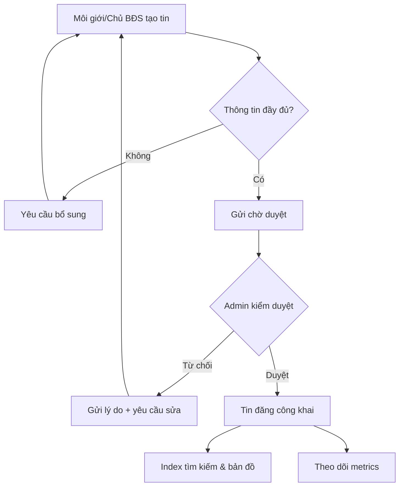
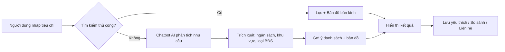
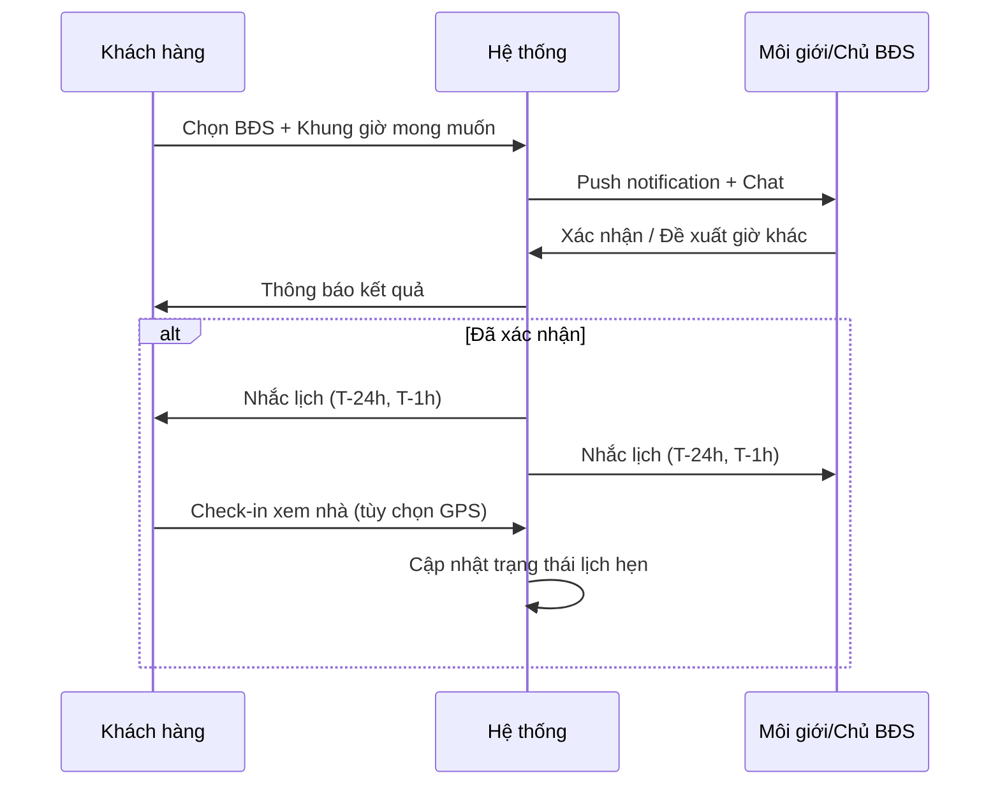
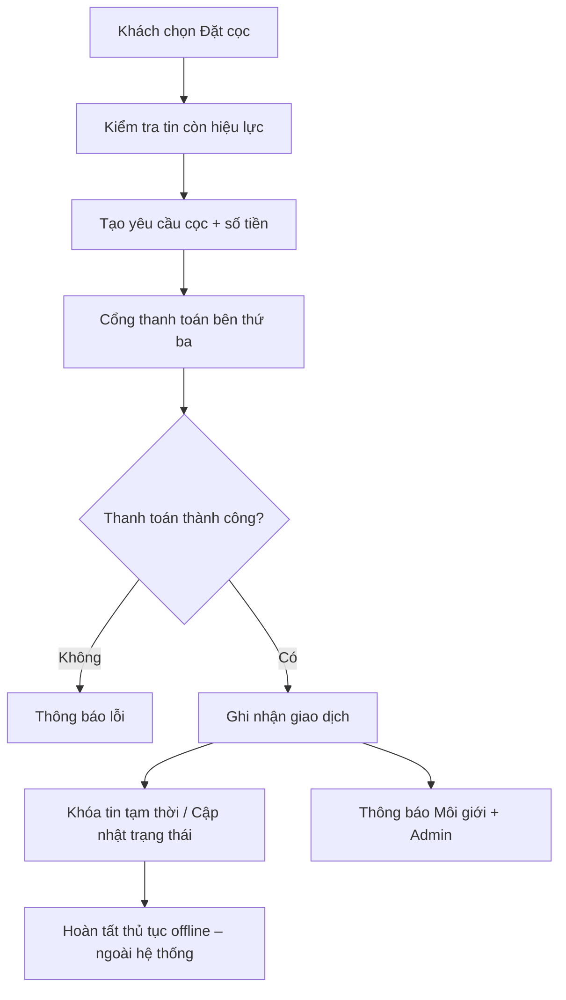

# PHÂN TÍCH NGHIỆP VỤ
## Đề tài: Xây dựng hệ thống mua bán và cho thuê bất động sản

| Thông tin | Chi tiết |
|-----------|----------|
| **Tên đề tài** | Xây dựng hệ thống mua bán và cho thuê bất động sản |
| **Nền tảng** | Web App & Mobile App (đa nền tảng) |
| **Kiến trúc dự kiến** | Microservices phân tán |
| **Phiên bản tài liệu** | 1.1 |
| **Ngày lập** | 12/08/2026 |
| **Cập nhật IA giao diện** | 15/08/2026 |

---

## Mục lục

1. [Tổng quan đề tài](#1-tổng-quan-đề-tài)
2. [Bối cảnh và vấn đề nghiệp vụ](#2-bối-cảnh-và-vấn-đề-nghiệp-vụ)
3. [Mục tiêu và phạm vi](#3-mục-tiêu-và-phạm-vi)
4. [Các bên liên quan và vai trò người dùng](#4-các-bên-liên-quan-và-vai-trò-người-dùng)
5. [Phân tích nghiệp vụ theo nhóm đối tượng](#5-phân-tích-nghiệp-vụ-theo-nhóm-đối-tượng)
6. [Quy trình nghiệp vụ cốt lõi](#6-quy-trình-nghiệp-vụ-cốt-lõi)
7. [Yêu cầu chức năng](#7-yêu-cầu-chức-năng)
8. [Yêu cầu phi chức năng](#8-yêu-cầu-phi-chức-năng)
9. [Mô hình dữ liệu nghiệp vụ (sơ bộ)](#9-mô-hình-dữ-liệu-nghiệp-vụ-sơ-bộ)
10. [Lộ trình triển khai 5 giai đoạn](#10-lộ-trình-triển-khai-5-giai-đoạn)
11. [Sản phẩm đầu ra và tiêu chí đánh giá](#11-sản-phẩm-đầu-ra-và-tiêu-chí-đánh-giá)
12. [Rủi ro và giải pháp](#12-rủi-ro-và-giải-pháp)
13. [Kết luận](#13-kết-luận)

---

## 1. Tổng quan đề tài

### 1.1. Mô tả

Phát triển nền tảng công nghệ đa nền tảng (Web & Mobile App) nhằm **số hóa quy trình tìm kiếm, giao dịch và quản lý bất động sản** (cho thuê & mua bán). Hệ thống tích hợp:

- Tìm kiếm thông minh theo **tọa độ / bán kính trên bản đồ**
- **Đặt lịch xem BĐS** thực tế
- **Kênh giao tiếp bảo mật, tức thì** giữa Khách hàng và Chủ sở hữu / Môi giới
- **Cổng giao dịch / đặt cọc** an toàn
- **Trợ lý AI (Chatbot)** gợi ý BĐS phù hợp
- **Dashboard phân tích** chỉ số kinh doanh

### 1.2. Giá trị cốt lõi

| Giá trị | Mô tả |
|---------|-------|
| **Kết nối** | Liên kết người mua/thuê với môi giới, chủ BĐS và sàn giao dịch |
| **Minh bạch** | Thông tin BĐS, pháp lý, lịch sử tương tác được quản lý tập trung |
| **Tiện lợi** | Tìm kiếm trực quan, đặt lịch, chat và thanh toán trên một nền tảng |
| **Thông minh** | AI phân tích nhu cầu, gợi ý BĐS; dashboard hỗ trợ ra quyết định |

---

## 2. Bối cảnh và vấn đề nghiệp vụ

### 2.1. Bối cảnh thị trường

Thị trường bất động sản Việt Nam phát triển mạnh nhưng quy trình tìm kiếm và giao dịch vẫn còn nhiều hạn chế:

- Thông tin tin đăng **phân tán**, khó xác minh
- Người tìm BĐS khó **so sánh** theo vị trí, giá, tiện ích
- Liên hệ giữa khách hàng và môi giới **chậm**, thiếu lịch sử trao đổi
- Quy trình **xem nhà, đặt cọc** thường thủ công, dễ xung đột lịch
- Chủ BĐS / môi giới thiếu công cụ **đo lường hiệu quả** tin đăng

### 2.2. Vấn đề cần giải quyết

```
┌─────────────────────────────────────────────────────────────────┐
│                    VẤN ĐỀ NGHIỆP VỤ HIỆN TẠI                    │
├─────────────────────────────────────────────────────────────────┤
│  Người tìm BĐS     │  Môi giới / Chủ BĐS    │  Quản trị viên   │
├────────────────────┼────────────────────────┼──────────────────┤
│ Tìm kiếm kém trực  │ Quản lý tin đăng thủ  │ Khó kiểm duyệt    │
│ quan trên bản đồ   │ công, thiếu thống kê  │ nội dung số lượng │
│                    │                        │ lớn               │
│ Khó lọc theo tiêu  │ Lịch xem nhà xung     │ Thiếu báo cáo     │
│ chí phức hợp       │ đột, nhắc nhở thủ công│ tổng hợp hệ thống │
│                    │                        │                   │
│ Liên hệ rời rạc    │ Mất lead do phản hồi  │ Gian lận tin      │
│ (Zalo, điện thoại) │ chậm                  │ đăng khó phát hiện│
└────────────────────┴────────────────────────┴──────────────────┘
                              │
                              ▼
              ┌───────────────────────────────┐
              │   HỆ THỐNG BĐS ĐỀ XUẤT         │
              │   Số hóa – Tích hợp – Thông minh│
              └───────────────────────────────┘
```

---

## 3. Mục tiêu và phạm vi

### 3.1. Mục tiêu cần đạt được

1. **Kết nối** Khách hàng với Nhà môi giới / Sàn BĐS
2. **Tra cứu trực quan** trên bản đồ tương tác theo nhiều tiêu chí:
   - Khoảng giá
   - Tình trạng pháp lý
   - Loại hình BĐS (nhà phố, căn hộ, đất nền, v.v.)
   - Tiện ích xung quanh (trường học, bệnh viện, siêu thị, giao thông)
3. **Quản lý vòng đời** đặt lịch hẹn xem nhà/đất
4. **Tích hợp cổng** giao dịch / đặt cọc an toàn
5. **Real-time Messaging** + **Push Notification**
6. **Chatbot AI** tự động phân tích nhu cầu, gợi ý BĐS
7. **Dashboard** phân tích chỉ số kinh doanh, lượt tương tác, hiệu quả tin đăng

### 3.2. Phạm vi hệ thống (In Scope)

| Hạng mục | Chi tiết |
|----------|----------|
| Ứng dụng người dùng | Web App, Mobile App (iOS/Android) |
| Loại giao dịch | Mua bán, cho thuê |
| Chức năng cốt lõi | Tin đăng, tìm kiếm bản đồ, lịch xem, chat, thanh toán cọc |
| Quản trị | Dashboard admin, kiểm duyệt, báo cáo |
| Hỗ trợ AI | Chatbot tư vấn, gợi ý BĐS |

### 3.3. Ngoài phạm vi (Out of Scope – giai đoạn đầu)

- Ký hợp đồng điện tử có giá trị pháp lý đầy đủ (có thể tích hợp sau)
- Vay vốn ngân hàng / thẩm định giá chuyên sâu
- Quản lý vận hành tòa nhà (BMS) sau bàn giao
- Môi giới quốc tế / đa quốc gia

---

## 4. Các bên liên quan và vai trò người dùng

### 4.1. Sơ đồ các bên liên quan

```
                    ┌──────────────────┐
                    │  Quản trị viên   │
                    │  (Admin/Sàn BĐS) │
                    └────────┬─────────┘
                             │ quản lý, kiểm duyệt
                             ▼
┌──────────────┐    ┌──────────────────┐    ┌──────────────┐
│ Người tìm    │◄──►│   Nền tảng BĐS   │◄──►│ Môi giới /   │
│ BĐS          │    │   (Web + Mobile) │    │ Chủ BĐS      │
│ (Buyer/Renter)│    └────────┬─────────┘    └──────────────┘
└──────────────┘             │
                             ▼
              ┌──────────────────────────────┐
              │ Dịch vụ bên thứ ba         │
              │ • Bản đồ (Google/OSM)      │
              │ • Cổng thanh toán          │
              │ • Push Notification (FCM)  │
              │ • AI / NLP Engine          │
              └──────────────────────────────┘
```

### 4.2. Ba nhóm đối tượng chính (theo giai đoạn khảo sát)

#### A. Người tìm BĐS (Khách hàng cuối)

**Đặc điểm:** Người có nhu cầu mua hoặc thuê; ưu tiên tốc độ, độ tin cậy thông tin, trải nghiệm mobile.

**Pain points:**
- Mất thời gian lọc tin không phù hợp
- Không biết khu vực nào phù hợp ngân sách
- Sợ tin ảo, thông tin sai lệch
- Khó sắp xếp lịch xem nhiều BĐS

**Kỳ vọng:**
- Tìm trên bản đồ theo vị trí làm việc / tiện ích
- Chat nhanh với môi giới
- Nhắc lịch xem nhà tự động
- Gợi ý BĐS thông minh

---

#### B. Môi giới / Chủ BĐS (Người đăng tin)

**Đặc điểm:** Cá nhân hoặc đại diện sàn; cần quản lý nhiều tin, theo dõi lead, tối ưu chuyển đổi.

**Pain points:**
- Tin đăng bị lu mờ trong danh sách
- Khó theo dõi khách quan tâm từng BĐS
- Lịch xem nhà chồng chéo
- Không có số liệu hiệu quả (view, click, conversion)

**Kỳ vọng:**
- Đăng tin nhanh, có mẫu chuẩn
- Nhận thông báo lead real-time
- Dashboard hiệu suất từng tin
- Quản lý lịch hẹn tập trung

---

#### C. Quản trị viên (Admin / Sàn BĐS)

**Đặc điểm:** Vận hành nền tảng, đảm bảo chất lượng nội dung và an toàn giao dịch.

**Pain points:**
- Khối lượng tin đăng cần kiểm duyệt lớn
- Gian lận, tin trùng lặp
- Thiếu báo cáo tổng hợp cho ban lãnh đạo
- Quản lý phân quyền người dùng phức tạp

**Kỳ vọng:**
- Hàng đợi kiểm duyệt rõ ràng
- Báo cáo KPI theo thời gian thực / định kỳ
- Công cụ xử lý khiếu nại, báo cáo vi phạm
- Cấu hình phí, chính sách nền tảng

---

## 5. Phân tích nghiệp vụ theo nhóm đối tượng

### 5.1. Ma trận chức năng – Vai trò

| Chức năng | Người tìm BĐS | Môi giới/Chủ BĐS | Quản trị viên |
|-----------|:-------------:|:----------------:|:-------------:|
| Đăng ký / Đăng nhập | ✓ | ✓ | ✓ |
| Tìm kiếm & lọc BĐS | ✓ | ✓ (xem thị trường) | ✓ |
| Bản đồ tương tác | ✓ | ✓ | ✓ |
| Xem chi tiết tin đăng | ✓ | ✓ | ✓ |
| Lưu / Yêu thích | ✓ | — | — |
| So sánh BĐS | ✓ | — | — |
| Chat real-time | ✓ | ✓ | ✓ (giám sát) |
| Chatbot AI | ✓ | ✓ | — |
| Đặt lịch xem BĐS | ✓ | ✓ (xác nhận) | ✓ (xem) |
| Đặt cọc / Thanh toán | ✓ | ✓ (nhận thông báo) | ✓ (giám sát) |
| Đăng / Sửa tin BĐS | — | ✓ | ✓ |
| Dashboard hiệu suất | — | ✓ | ✓ |
| Kiểm duyệt tin | — | — | ✓ |
| Quản lý người dùng | — | — | ✓ |
| Báo cáo & Thống kê | — | ✓ (cá nhân) | ✓ (toàn hệ thống) |
| Push Notification | ✓ | ✓ | ✓ |

### 5.2. Hành trình người dùng (User Journey)

#### Người tìm BĐS – Thuê căn hộ

```
Khám phá → Tìm kiếm trên bản đồ → Lọc tiêu chí → Xem chi tiết
    → Chat / Chatbot hỏi thêm → Đặt lịch xem → Nhận nhắc lịch
    → Xem thực tế → Đặt cọc online → Hoàn tất / Đánh giá
```

#### Môi giới – Đăng tin mới

```
Đăng nhập → Tạo tin (ảnh, mô tả, pháp lý, tọa độ) → Gửi duyệt
    → Admin phê duyệt → Tin hiển thị → Nhận lead qua chat
    → Xác nhận lịch xem → Cập nhật trạng thái (đã cọc / đã bán)
```

### 5.3. Kiến trúc thông tin giao diện Web (IA — đã hiện thực demo)

Hệ thống Web demo được tổ chức thành **3 portal độc lập**, mỗi portal bám sát hành trình người dùng thay vì liệt kê tính năng rời rạc.

#### A. Portal Người tìm BĐS (`/client/*`) — Marketplace

| Route | Màn hình | Nghiệp vụ |
|-------|----------|-----------|
| `/client` | Trang chủ | Hero tìm kiếm, gợi ý AI, tin nổi bật |
| `/client/tim-kiem` | Tìm kiếm thống nhất | Tab Mua/Thuê + bản đồ 60% + danh sách 40% |
| `/client/property/:id` | Chi tiết BĐS | Gallery, POI, CTA đặt lịch & chat |
| `/client/hoat-dong` | Hoạt động của tôi | Tab: Lịch hẹn \| Tin nhắn \| Đặt cọc |
| `/client/giao-dich` | Giao dịch của tôi | BĐS đang thuê, đang mua, đã hoàn tất |
| `/client/da-luu` | Đã lưu | Tab: Yêu thích \| So sánh BĐS |
| `/client/chat` | Chat & AI | Hộp thư + Trợ lý AI |
| `/client/ca-nhan` | Tài khoản | Hồ sơ, thông báo |

**Điều hướng:** Header (desktop) + Bottom navigation (mobile) gồm 5 mục: Trang chủ · Tìm kiếm · Hoạt động · Đã lưu · Tài khoản.

**Redirect tương thích:** `/client/buy`, `/client/rent`, `/client/search` → `/client/tim-kiem`; `/client/bookings` → `/client/hoat-dong`.

#### B. Portal Môi giới (`/broker/*`) — CRM Console

| Route | Màn hình | Nghiệp vụ |
|-------|----------|-----------|
| `/broker` | Tổng quan | KPI + **Việc cần làm hôm nay** |
| `/broker/properties` | Tin đăng | Pipeline + wizard 5 bước tạo tin |
| `/broker/khach-hang` | Khách hàng & Lead | Tab: Hộp thư \| Lead mới (gộp CRM) |
| `/broker/bookings` | Lịch hẹn | Calendar + bảng xác nhận |
| `/broker/giao-dich` | Giao dịch | BĐS đã cho thuê / bán / đang xử lý |
| `/broker/phan-tich` | Phân tích | Biểu đồ hiệu suất tin đăng |
| `/broker/profile` | Hồ sơ & Gói tin | Thông tin môi giới |

**Redirect:** `/broker/leads`, `/broker/inbox` → `/broker/khach-hang`.

#### C. Portal Quản trị (`/admin/*`) — Ops Console

| Route | Màn hình | Nghiệp vụ |
|-------|----------|-----------|
| `/admin/dashboard` | Tổng quan | KPI hệ thống, biểu đồ |
| `/admin/moderation` | Kiểm duyệt | Hàng đợi duyệt/từ chối tin |
| `/admin/users` | Người dùng | Quản lý tài khoản |
| `/admin/transactions` | Giao dịch | Giám sát đặt cọc |
| `/admin/van-hanh` | Vận hành | Tab: Lịch hẹn \| Cọc \| Chat monitor \| Báo cáo vi phạm |
| `/admin/logs` | Nhật ký | Audit log |
| `/admin/settings` | Cài đặt | Chính sách nền tảng |

#### D. Hệ thiết kế thống nhất (Design System)

Ba portal dùng **một bộ visual language**:

| Thành phần | Quy chuẩn |
|------------|-----------|
| Màu chủ đạo | `brand-600` (#059669) — xanh emerald |
| Nền app | `slate-50` |
| Sidebar (Broker/Admin) | Trắng, nav active `brand-50` |
| Topbar | Trắng, search + bell + avatar |
| Logo | `BDS Pro` + badge role (KH / MG / QT) |
| Card | `rounded-2xl`, border slate-200 |
| Button primary | `portal-btn-primary` |

**Client** giữ top nav + bottom nav (marketplace); **Broker/Admin** dùng sidebar + topbar cùng component `PortalSidebar` / `PortalTopBar`.

#### E. Luồng demo đề tài (3 phút / vai trò)

```
Người tìm BĐS:  Trang chủ → Tìm kiếm bản đồ → Chi tiết → Chat → Hoạt động (Lịch + Cọc)
Môi giới:       Tổng quan (Việc cần làm) → Khách hàng → Lịch hẹn → Phân tích
Quản trị:       Dashboard → Kiểm duyệt → Vận hành (Chat + Báo cáo)
```

---

## 6. Quy trình nghiệp vụ cốt lõi

### 6.1. Quy trình đăng tin BĐS



**Quy tắc nghiệp vụ:**
- Tin bắt buộc có: tiêu đề, loại BĐS, hình thức (bán/thuê), giá, diện tích, địa chỉ, tọa độ GPS, ít nhất 3 ảnh
- Trạng thái tin: `Nháp` → `Chờ duyệt` → `Đang hiển thị` → `Đã giao dịch` / `Hết hạn` / `Từ chối`
- Tin hết hạn sau X ngày (cấu hình bởi Admin), có thể gia hạn

---

### 6.2. Quy trình tìm kiếm và gợi ý BĐS



**Quy tắc nghiệp vụ:**
- Tìm theo bán kính: mặc định 1km, 3km, 5km, 10km (có thể tùy chỉnh)
- Sắp xếp: mới nhất, giá tăng/giảm, gần nhất, phù hợp AI score
- Chatbot thu thập tối thiểu 3 thông tin trước khi gợi ý chính xác

---

### 6.3. Quy trình đặt lịch xem BĐS



**Trạng thái lịch hẹn:** `Chờ xác nhận` → `Đã xác nhận` → `Hoàn thành` / `Khách hủy` / `Môi giới hủy` / `Không đến`

---

### 6.4. Quy trình đặt cọc / giao dịch



**Quy tắc nghiệp vụ:**
- Số tiền cọc do môi giới/chủ BĐS cấu hình hoặc theo chính sách sàn
- Tiền cọc giữ qua escrow (ký quỹ) nếu tích hợp cổng hỗ trợ
- Hoàn cọc / tranh chấp: quy trình khiếu nại qua Admin

---

### 6.5. Quy trình chat và thông báo

| Sự kiện | Người nhận thông báo | Kênh |
|---------|---------------------|------|
| Tin nhắn mới | Người nhận chat | Push + In-app |
| Lịch hẹn được xác nhận | Khách hàng | Push + Email |
| Lead mới quan tâm BĐS | Môi giới | Push + Dashboard |
| Tin đăng được duyệt/từ chối | Môi giới | Push + In-app |
| Thanh toán cọc thành công | Môi giới, Admin | Push + Email |
| Gợi ý BĐS mới (AI) | Khách hàng | Push (opt-in) |

---

## 7. Yêu cầu chức năng

### 7.1. Module Quản lý người dùng & Xác thực

| ID | Yêu cầu | Ưu tiên |
|----|---------|---------|
| FR-U01 | Đăng ký tài khoản (email/SĐT, OAuth Google/Facebook) | Cao |
| FR-U02 | Đăng nhập, quên mật khẩu, xác thực OTP | Cao |
| FR-U03 | Phân quyền theo vai trò: Khách, Môi giới, Chủ BĐS, Admin | Cao |
| FR-U04 | Hồ sơ cá nhân: avatar, thông tin liên hệ, lịch sử giao dịch | Trung bình |
| FR-U05 | Xác minh danh tính môi giới (upload CMND/CCCD, giấy phép) | Trung bình |

### 7.2. Module Tin đăng BĐS

| ID | Yêu cầu | Ưu tiên |
|----|---------|---------|
| FR-L01 | CRUD tin đăng với đa phương tiện (ảnh, video, tour 360° – tùy chọn) | Cao |
| FR-L02 | Phân loại: loại BĐS, hình thức mua bán/thuê, trạng thái pháp lý | Cao |
| FR-L03 | Gắn tọa độ GPS / chọn trên bản đồ | Cao |
| FR-L04 | Mô tả tiện ích xung quanh (POI) | Trung bình |
| FR-L05 | Quản lý trạng thái tin (nháp, chờ duyệt, hiển thị, đã giao dịch) | Cao |
| FR-L06 | Gia hạn / Ẩn / Xóa tin | Trung bình |

### 7.3. Module Tìm kiếm & Bản đồ

| ID | Yêu cầu | Ưu tiên |
|----|---------|---------|
| FR-S01 | Tìm kiếm full-text theo từ khóa, địa điểm | Cao |
| FR-S02 | Lọc đa tiêu chí: giá, diện tích, loại, pháp lý, hình thức | Cao |
| FR-S03 | Hiển thị marker BĐS trên bản đồ tương tác | Cao |
| FR-S04 | Tìm kiếm theo bán kính từ điểm / vị trí hiện tại | Cao |
| FR-S05 | Cluster marker khi zoom out | Trung bình |
| FR-S06 | Lưu yêu thích, so sánh tối đa N BĐS | Trung bình |
| FR-S07 | Lịch sử tìm kiếm gần đây | Thấp |

### 7.4. Module Lịch hẹn xem BĐS

| ID | Yêu cầu | Ưu tiên |
|----|---------|---------|
| FR-A01 | Khách đặt lịch với khung giờ đề xuất | Cao |
| FR-A02 | Môi giới xác nhận / từ chối / đề xuất giờ khác | Cao |
| FR-A03 | Lịch cá nhân (calendar view) cho cả hai bên | Cao |
| FR-A04 | Nhắc lịch tự động qua Push / Email | Cao |
| FR-A05 | Đánh giá sau buổi xem (rating & review) | Trung bình |

### 7.5. Module Chat & Chatbot AI

| ID | Yêu cầu | Ưu tiên |
|----|---------|---------|
| FR-C01 | Chat 1-1 real-time giữa khách và môi giới | Cao |
| FR-C02 | Gửi ảnh, link tin BĐS trong chat | Trung bình |
| FR-C03 | Trạng thái online / đã đọc | Trung bình |
| FR-C04 | Chatbot AI: thu thập nhu cầu, trả lời FAQ | Cao |
| FR-C05 | Chatbot gợi ý danh sách BĐS phù hợp | Cao |
| FR-C06 | Chuyển tiếp từ chatbot sang môi giới thật | Trung bình |

### 7.6. Module Thanh toán & Đặt cọc

| ID | Yêu cầu | Ưu tiên |
|----|---------|---------|
| FR-P01 | Tạo yêu cầu đặt cọc gắn với tin BĐS | Cao |
| FR-P02 | Tích hợp cổng thanh toán (VNPay, MoMo, Stripe, v.v.) | Cao |
| FR-P03 | Lịch sử giao dịch, biên lai điện tử | Cao |
| FR-P04 | Quy trình hoàn tiền / khiếu nại | Trung bình |

### 7.7. Module Dashboard & Báo cáo

| ID | Yêu cầu | Ưu tiên |
|----|---------|---------|
| FR-D01 | Dashboard môi giới: lượt xem, click, lead, conversion | Cao |
| FR-D02 | Dashboard admin: tổng tin, người dùng, doanh thu, giao dịch | Cao |
| FR-D03 | Biểu đồ xu hướng theo thời gian | Trung bình |
| FR-D04 | Xuất báo cáo PDF/Excel | Trung bình |
| FR-D05 | Top tin hiệu quả / khu vực hot | Trung bình |

### 7.8. Module Quản trị hệ thống

| ID | Yêu cầu | Ưu tiên |
|----|---------|---------|
| FR-AD01 | Hàng đợi kiểm duyệt tin đăng | Cao |
| FR-AD02 | Quản lý người dùng (khóa, phân quyền) | Cao |
| FR-AD03 | Xử lý báo cáo vi phạm / khiếu nại | Trung bình |
| FR-AD04 | Cấu hình hệ thống: phí, thời hạn tin, template thông báo | Trung bình |
| FR-AD05 | Audit log hoạt động quan trọng | Trung bình |

---

## 8. Yêu cầu phi chức năng

| ID | Hạng mục | Mô tả | Tiêu chí |
|----|----------|-------|----------|
| NFR-01 | Hiệu năng | Thời gian phản hồi API | < 500ms (P95) cho API thông thường |
| NFR-02 | Hiệu năng | Tải bản đồ với 500+ marker | < 3 giây |
| NFR-03 | Khả dụng | Uptime hệ thống | ≥ 99.5% |
| NFR-04 | Bảo mật | Mã hóa dữ liệu | HTTPS, mã hóa at-rest cho PII |
| NFR-05 | Bảo mật | Xác thực API | JWT / OAuth 2.0 |
| NFR-06 | Mở rộng | Kiến trúc | Microservices, scale ngang từng service |
| NFR-07 | Đa nền tảng | Responsive Web + Native/Hybrid Mobile | iOS 14+, Android 8+ |
| NFR-08 | Real-time | Độ trễ chat | < 1 giây |
| NFR-09 | Khả năng sử dụng | UX | WCAG 2.1 Level AA (mục tiêu) |
| NFR-10 | Sao lưu | Dữ liệu | Backup hàng ngày, RPO ≤ 24h |
| NFR-11 | Tuân thủ | Quyền riêng tư | Tuân thủ Nghị định 13/2023/NĐ-CP (PDPD) |

---

## 9. Mô hình dữ liệu nghiệp vụ (sơ bộ)

### 9.1. Thực thể chính

```
┌─────────────┐     ┌─────────────┐     ┌─────────────┐
│    User     │────►│   Listing   │◄────│   Media     │
│  (Người dùng)│     │  (Tin BĐS)  │     │  (Ảnh/Video)│
└──────┬──────┘     └──────┬──────┘     └─────────────┘
       │                   │
       │            ┌──────┴──────┐
       │            │             │
       ▼            ▼             ▼
┌─────────────┐ ┌─────────┐ ┌─────────────┐
│ Appointment │ │ Favorite│ │ Transaction │
│ (Lịch hẹn)  │ │(Yêu thích)│ │ (Giao dịch) │
└─────────────┘ └─────────┘ └─────────────┘
       │
       ▼
┌─────────────┐     ┌─────────────┐
│ Conversation│────►│   Message   │
│  (Cuộc hội thoại)│  (Tin nhắn)  │
└─────────────┘     └─────────────┘
```

### 9.2. Thuộc tính quan trọng – Tin BĐS (Listing)

| Trường | Kiểu | Mô tả |
|--------|------|-------|
| id | UUID | Khóa chính |
| title | String | Tiêu đề tin |
| type | Enum | apartment, house, land, office, ... |
| transaction_type | Enum | sale, rent |
| price | Decimal | Giá bán hoặc giá thuê/tháng |
| area | Decimal | Diện tích (m²) |
| legal_status | Enum | sổ hồng, sổ đỏ, hợp đồng, ... |
| address | String | Địa chỉ chi tiết |
| latitude, longitude | Float | Tọa độ |
| amenities | JSON | Tiện ích nội/ngoại khu |
| status | Enum | draft, pending, active, sold, expired |
| owner_id | FK → User | Chủ tin / môi giới |
| view_count | Integer | Lượt xem |
| created_at, updated_at | DateTime | Thời gian |

---

## 10. Lộ trình triển khai 5 giai đoạn

### Giai đoạn 1: Phân tích nghiệp vụ & Khảo sát UX (4–6 tuần)

**Mục tiêu:** Hiểu sâu nhu cầu 3 nhóm đối tượng.

| Hoạt động | Đầu ra |
|-----------|--------|
| Phỏng vấn / khảo sát người tìm BĐS | Persona + Pain points |
| Phỏng vấn môi giới, chủ BĐS | User story, quy trình AS-IS |
| Workshop với quản trị viên sàn | Yêu cầu quản trị, KPI |
| Phân tích đối thủ (Batdongsan, Chotot, v.v.) | Benchmark feature |
| Tổng hợp | **Tài liệu phân tích nghiệp vụ** (tài liệu này) |

---

### Giai đoạn 2: Thu thập yêu cầu người dùng (3–4 tuần)

**Mục tiêu:** Chuyển hóa nghiệp vụ thành yêu cầu có thể triển khai.

| Hoạt động | Đầu ra |
|-----------|--------|
| Viết User Story + Acceptance Criteria | Product Backlog |
| Ưu tiên MoSCoW / WSJF | Roadmap chức năng |
| Prototype wireframe sơ bộ | Figma / Balsamiq |
| Review với stakeholder | Sign-off yêu cầu |

---

### Giai đoạn 3: Thiết kế kiến trúc & UI/UX (4–6 tuần)

**Mục tiêu:** Thiết kế hệ thống có khả năng mở rộng và UX tối ưu.

| Hoạt động | Đầu ra |
|-----------|--------|
| Thiết kế Microservices (domain-driven) | Sơ đồ kiến trúc, API contract |
| Thiết kế CSDL từng service | ERD, migration plan |
| UI/UX Design System | Mockup high-fidelity Web + Mobile |
| Thiết kế tích hợp bản đồ, payment, AI | Integration spec |
| Security & DevOps plan | CI/CD, monitoring |

**Microservices đề xuất (sơ bộ):**

| Service | Trách nhiệm |
|---------|-------------|
| API Gateway | Routing, auth, rate limit |
| User Service | Đăng ký, profile, phân quyền |
| Listing Service | CRUD tin BĐS, tìm kiếm |
| Geo/Map Service | Tọa độ, bán kính, POI |
| Appointment Service | Lịch hẹn xem nhà |
| Chat Service | Real-time messaging (WebSocket) |
| Notification Service | Push, email, SMS |
| Payment Service | Đặt cọc, giao dịch |
| AI Service | Chatbot, gợi ý BĐS |
| Analytics Service | Dashboard, báo cáo |
| Admin Service | Kiểm duyệt, cấu hình |

---

### Giai đoạn 4: Hiện thực hệ thống (10–14 tuần)

**Mục tiêu:** Xây dựng MVP → Full feature theo roadmap.

| Sprint | Phạm vi gợi ý |
|--------|---------------|
| Sprint 1–2 | Auth, User profile, Listing CRUD cơ bản |
| Sprint 3–4 | Tìm kiếm, bản đồ, lọc |
| Sprint 5–6 | Chat real-time, Notification |
| Sprint 7–8 | Lịch hẹn, Payment integration |
| Sprint 9–10 | Chatbot AI, Dashboard |
| Sprint 11–12 | Admin, kiểm duyệt, polish UX |

---

### Giai đoạn 5: Triển khai, chạy thực nghiệm & Kiểm thử (4–6 tuần)

**Mục tiêu:** Đưa hệ thống vào môi trường thật, đánh giá kết quả.

| Hoạt động | Đầu ra |
|-----------|--------|
| Deploy staging → production | Hệ thống live |
| UAT với nhóm pilot (môi giới + khách) | Biên bản UAT |
| Kiểm thử: unit, integration, E2E, performance | Test report |
| Thu thập feedback, analytics | Báo cáo cải tiến |
| Viết báo cáo kỹ thuật đồ án | **Báo cáo đồ án** |

---

## 11. Sản phẩm đầu ra và tiêu chí đánh giá

### 11.1. Chuẩn đầu ra (theo đề tài)

| STT | Sản phẩm | Mô tả |
|-----|----------|-------|
| 1 | **Phần mềm** | Web App + Mobile App có tính khả thi thực tế |
| 2 | **Báo cáo kỹ thuật** | Mô tả kiến trúc, công nghệ, quy trình phát triển |
| 3 | **Trình bày công nghệ** | Thành viên nắm vững và trình bày được stack đã áp dụng |

### 11.2. Tiêu chí đánh giá MVP thành công

| Tiêu chí | Ngưỡng |
|----------|--------|
| Đăng và duyệt tin BĐS end-to-end | Hoạt động ổn định |
| Tìm kiếm trên bản đồ theo bán kính | Chính xác ≥ 95% |
| Chat real-time | Độ trễ < 1s trong mạng LAN/WAN bình thường |
| Đặt lịch + nhắc lịch | 100% flow happy path |
| Thanh toán cọc (sandbox) | Tích hợp thành công ít nhất 1 cổng |
| Chatbot gợi ý | Trả lời đúng ≥ 3 loại câu hỏi mẫu |
| Dashboard | Hiển thị đúng metrics cơ bản |

### 11.3. Công nghệ gợi ý (tham khảo)

| Tầng | Công nghệ gợi ý |
|------|-----------------|
| Frontend Web | React / Next.js, TypeScript |
| Mobile | React Native / Flutter |
| Backend | Node.js (NestJS) / Java (Spring Boot) / .NET |
| Database | PostgreSQL + PostGIS, Redis |
| Search | Elasticsearch |
| Message Queue | RabbitMQ / Kafka |
| Real-time | Socket.io / WebSocket |
| Map | Google Maps API / Mapbox / OpenStreetMap |
| AI Chatbot | OpenAI API / Gemini + RAG trên dữ liệu BĐS |
| Cloud | AWS / GCP / Azure |
| DevOps | Docker, Kubernetes, GitHub Actions |

---

## 12. Rủi ro và giải pháp

| Rủi ro | Mức độ | Giải pháp |
|--------|--------|-----------|
| Tin đăng ảo, gian lận | Cao | Kiểm duyệt + xác minh môi giới + báo cáo vi phạm |
| Chi phí API bản đồ cao | Trung bình | Cache, cluster marker, giới hạn request |
| Độ phức tạp Microservices | Trung bình | Bắt đầu modular monolith, tách dần khi cần |
| Chatbot trả lời sai | Trung bình | RAG trên dữ liệu chuẩn, fallback sang môi giới |
| Bảo mật thanh toán | Cao | PCI-DSS qua cổng bên thứ ba, không lưu thẻ |
| Scope creep | Cao | MoSCoW rõ ràng, MVP trước |
| Thiếu dữ liệu BĐS ban đầu | Trung bình | Seed data, hợp tác sàn pilot |

---

## 13. Kết luận

Hệ thống mua bán và cho thuê bất động sản đề xuất giải quyết bài toán **số hóa toàn chuỗi** từ tìm kiếm, tư vấn, xem nhà đến đặt cọc — phục vụ ba nhóm người dùng cốt lõi với trải nghiệm thống nhất trên Web và Mobile.

Phân tích nghiệp vụ xác định **7 module chức năng chính**, **5 quy trình nghiệp vụ cốt lõi** và **lộ trình 5 giai đoạn** phù hợp với yêu cầu đồ án. Giai đoạn tiếp theo là **thu thập yêu cầu chi tiết (User Story)** và **thiết kế kiến trúc Microservices** dựa trên nền tảng tài liệu này.

---

## Phụ lục

### A. Thuật ngữ

| Thuật ngữ | Giải thích |
|-----------|------------|
| BĐS | Bất động sản |
| POI | Point of Interest – điểm tiện ích xung quanh |
| MVP | Minimum Viable Product – sản phẩm tối thiểu khả dụng |
| Escrow | Ký quỹ – giữ tiền cọc qua bên trung gian |
| Lead | Khách hàng tiềm năng quan tâm BĐS |
| UAT | User Acceptance Testing – kiểm thử chấp nhận người dùng |

### B. Tài liệu liên quan (sẽ bổ sung)

- [ ] Danh sách User Story chi tiết
- [ ] Sơ đồ kiến trúc Microservices
- [x] Wireframe / Mockup UI/UX (Web demo React — IA §5.3)
- [ ] Đặc tả API (OpenAPI/Swagger)
- [ ] Kế hoạch kiểm thử

---

*Tài liệu thuộc Giai đoạn 1 – Phân tích nghiệp vụ & Khảo sát trải nghiệm người dùng.*
