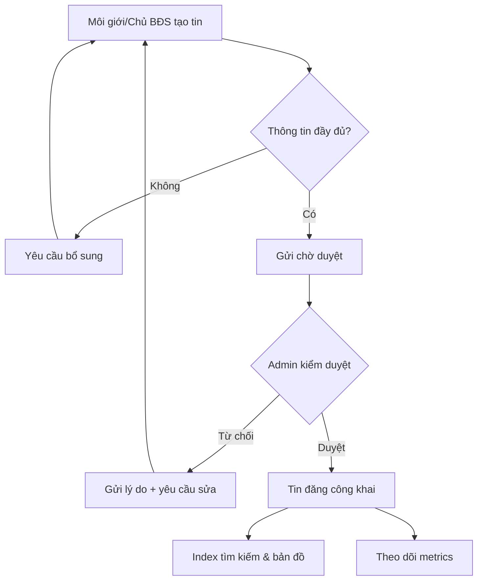
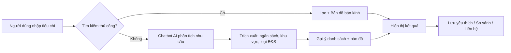
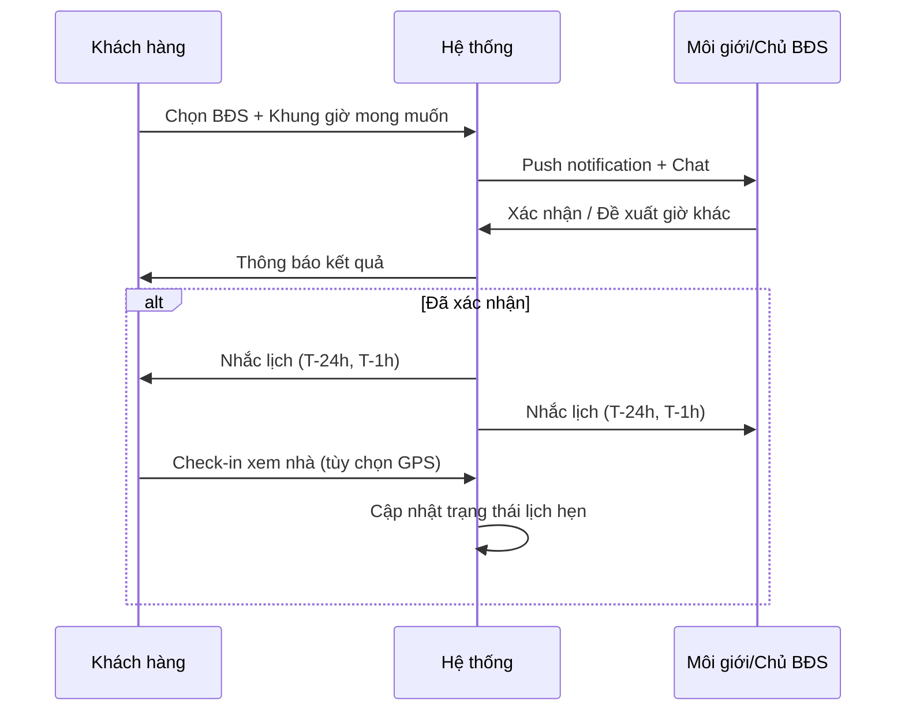
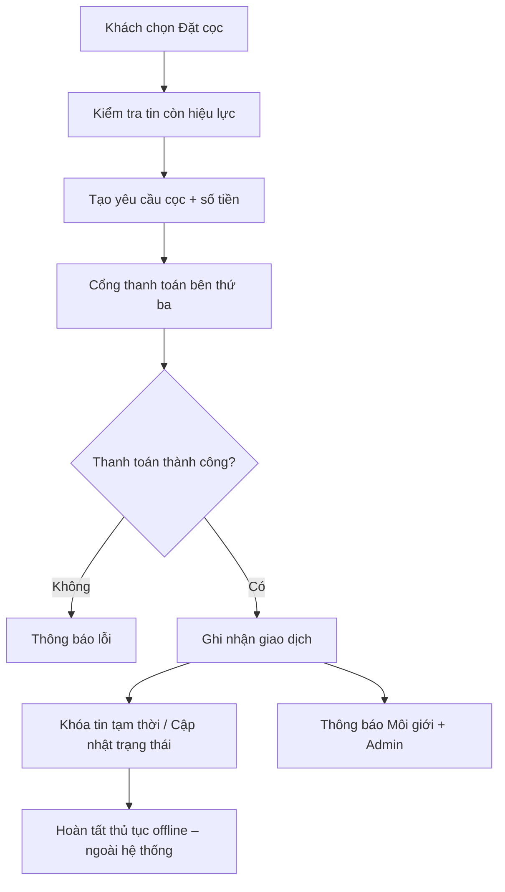

# PHÂN TÍCH NGHIỆP VỤ
## Đề tài: Xây dựng hệ thống mua bán và cho thuê bất động sản

| Thông tin | Chi tiết |
|-----------|----------|
| **Tên đề tài** | Xây dựng hệ thống mua bán và cho thuê bất động sản |
| **Nền tảng** | Web App & Mobile App (đa nền tảng) |
| **Kiến trúc dự kiến** | Microservices phân tán |
| **Phiên bản tài liệu** | 2.0 |
| **Ngày lập** | 12/08/2026 |
| **Cập nhật IA giao diện** | 15/08/2026 |
| **Cập nhật phân tích 4 role + chức năng Guest** | 04/09/2026 |

---

## Mục lục

1. [Tổng quan đề tài](#1-tổng-quan-đề-tài)
2. [Bối cảnh và vấn đề nghiệp vụ](#2-bối-cảnh-và-vấn-đề-nghiệp-vụ)
3. [Mục tiêu và phạm vi](#3-mục-tiêu-và-phạm-vi)
4. [Các bên liên quan và vai trò người dùng](#4-các-bên-liên-quan-và-vai-trò-người-dùng)
5. [Phân tích nghiệp vụ theo nhóm đối tượng](#5-phân-tích-nghiệp-vụ-theo-nhóm-đối-tượng)
6. [Quy trình nghiệp vụ cốt lõi](#6-quy-trình-nghiệp-vụ-cốt-lõi)
7. [Yêu cầu chức năng](#7-yêu-cầu-chức-năng)
8. [Yêu cầu phi chức năng](#8-yêu-cầu-phi-chức-năng)
9. [Mô hình dữ liệu nghiệp vụ (sơ bộ)](#9-mô-hình-dữ-liệu-nghiệp-vụ-sơ-bộ)
10. [Lộ trình triển khai 5 giai đoạn](#10-lộ-trình-triển-khai-5-giai-đoạn)
11. [Sản phẩm đầu ra và tiêu chí đánh giá](#11-sản-phẩm-đầu-ra-và-tiêu-chí-đánh-giá)
12. [Rủi ro và giải pháp](#12-rủi-ro-và-giải-pháp)
13. [Kết luận](#13-kết-luận)

---

## 1. Tổng quan đề tài

### 1.1. Mô tả

Phát triển nền tảng công nghệ đa nền tảng (Web & Mobile App) nhằm **số hóa quy trình tìm kiếm, giao dịch và quản lý bất động sản** (cho thuê & mua bán). Hệ thống tích hợp:

- Tìm kiếm thông minh theo **tọa độ / bán kính trên bản đồ**
- **Đặt lịch xem BĐS** thực tế
- **Kênh giao tiếp bảo mật, tức thì** giữa Khách hàng và Chủ sở hữu / Môi giới
- **Cổng giao dịch / đặt cọc** an toàn
- **Trợ lý AI (Chatbot)** gợi ý BĐS phù hợp
- **Dashboard phân tích** chỉ số kinh doanh

### 1.2. Giá trị cốt lõi

| Giá trị | Mô tả |
|---------|-------|
| **Kết nối** | Liên kết người mua/thuê với môi giới, chủ BĐS và sàn giao dịch |
| **Minh bạch** | Thông tin BĐS, pháp lý, lịch sử tương tác được quản lý tập trung |
| **Tiện lợi** | Tìm kiếm trực quan, đặt lịch, chat và thanh toán trên một nền tảng |
| **Thông minh** | AI phân tích nhu cầu, gợi ý BĐS; dashboard hỗ trợ ra quyết định |

---

## 2. Bối cảnh và vấn đề nghiệp vụ

### 2.1. Bối cảnh thị trường

Thị trường bất động sản Việt Nam phát triển mạnh nhưng quy trình tìm kiếm và giao dịch vẫn còn nhiều hạn chế:

- Thông tin tin đăng **phân tán**, khó xác minh
- Người tìm BĐS khó **so sánh** theo vị trí, giá, tiện ích
- Liên hệ giữa khách hàng và môi giới **chậm**, thiếu lịch sử trao đổi
- Quy trình **xem nhà, đặt cọc** thường thủ công, dễ xung đột lịch
- Chủ BĐS / môi giới thiếu công cụ **đo lường hiệu quả** tin đăng

### 2.2. Vấn đề cần giải quyết

```
┌─────────────────────────────────────────────────────────────────┐
│                    VẤN ĐỀ NGHIỆP VỤ HIỆN TẠI                    │
├─────────────────────────────────────────────────────────────────┤
│  Người tìm BĐS     │  Môi giới / Chủ BĐS    │  Quản trị viên   │
├────────────────────┼────────────────────────┼──────────────────┤
│ Tìm kiếm kém trực  │ Quản lý tin đăng thủ  │ Khó kiểm duyệt    │
│ quan trên bản đồ   │ công, thiếu thống kê  │ nội dung số lượng │
│                    │                        │ lớn               │
│ Khó lọc theo tiêu  │ Lịch xem nhà xung     │ Thiếu báo cáo     │
│ chí phức hợp       │ đột, nhắc nhở thủ công│ tổng hợp hệ thống │
│                    │                        │                   │
│ Liên hệ rời rạc    │ Mất lead do phản hồi  │ Gian lận tin      │
│ (Zalo, điện thoại) │ chậm                  │ đăng khó phát hiện│
└────────────────────┴────────────────────────┴──────────────────┘
                              │
                              ▼
              ┌───────────────────────────────┐
              │   HỆ THỐNG BĐS ĐỀ XUẤT         │
              │   Số hóa – Tích hợp – Thông minh│
              └───────────────────────────────┘
```

---

## 3. Mục tiêu và phạm vi

### 3.1. Mục tiêu cần đạt được

1. **Kết nối** Khách hàng với Nhà môi giới / Sàn BĐS
2. **Tra cứu trực quan** trên bản đồ tương tác theo nhiều tiêu chí:
   - Khoảng giá
   - Tình trạng pháp lý
   - Loại hình BĐS (nhà phố, căn hộ, đất nền, v.v.)
   - Tiện ích xung quanh (trường học, bệnh viện, siêu thị, giao thông)
3. **Quản lý vòng đời** đặt lịch hẹn xem nhà/đất
4. **Tích hợp cổng** giao dịch / đặt cọc an toàn
5. **Real-time Messaging** + **Push Notification**
6. **Chatbot AI** tự động phân tích nhu cầu, gợi ý BĐS
7. **Dashboard** phân tích chỉ số kinh doanh, lượt tương tác, hiệu quả tin đăng

### 3.2. Phạm vi hệ thống (In Scope)

| Hạng mục | Chi tiết |
|----------|----------|
| Ứng dụng người dùng | Web App, Mobile App (iOS/Android) |
| Loại giao dịch | Mua bán, cho thuê |
| Chức năng cốt lõi | Tin đăng, tìm kiếm bản đồ, lịch xem, chat, thanh toán cọc |
| Quản trị | Dashboard admin, kiểm duyệt, báo cáo |
| Hỗ trợ AI | Chatbot tư vấn, gợi ý BĐS |

### 3.3. Ngoài phạm vi (Out of Scope – giai đoạn đầu)

- Ký hợp đồng điện tử có giá trị pháp lý đầy đủ (có thể tích hợp sau)
- Vay vốn ngân hàng / thẩm định giá chuyên sâu
- Quản lý vận hành tòa nhà (BMS) sau bàn giao
- Môi giới quốc tế / đa quốc gia

---

## 4. Các bên liên quan và vai trò người dùng

### 4.1. Sơ đồ các bên liên quan

```
                    ┌──────────────────┐
                    │  Quản trị viên   │
                    │  (Admin/Sàn BĐS) │
                    └────────┬─────────┘
                             │ quản lý, kiểm duyệt
                             ▼
┌──────────────┐    ┌──────────────────┐    ┌──────────────┐
│ Người tìm    │◄──►│   Nền tảng BĐS   │◄──►│ Môi giới /   │
│ BĐS          │    │   (Web + Mobile) │    │ Chủ BĐS      │
│ (Buyer/Renter)│    └────────┬─────────┘    └──────────────┘
└──────────────┘             │
                             ▼
              ┌──────────────────────────────┐
              │ Dịch vụ bên thứ ba         │
              │ • Bản đồ (Google/OSM)      │
              │ • Cổng thanh toán          │
              │ • Push Notification (FCM)  │
              │ • AI / NLP Engine          │
              └──────────────────────────────┘
```

### 4.2. Hệ thống 4 vai trò (Role Model v2.0)

Hệ thống phân chia **4 vai trò người dùng rõ ràng**, mỗi vai trò có quyền hạn, giao diện và trải nghiệm riêng:

| Mã | Vai trò | Tên hiển thị | Mô tả | Quyền truy cập |
|----|---------|--------------|-------|----------------|
| **R0** | `guest` | Khách vãng lai | Người dùng chưa đăng nhập, truy cập nội dung công khai | Xem: Landing, danh sách BĐS, chi tiết, bản đồ, blog, so sánh, About. Bị chặn khi tương tác (lưu tin, đặt lịch, chat, đặt cọc) |
| **R1** | `user` (buyer) | Người tìm BĐS | Khách hàng đã đăng ký, có nhu cầu mua/thuê | Toàn quyền của guest + lưu yêu thích, đặt lịch xem, chat với môi giới, đặt cọc, AI Assistant |
| **R2** | `host` (agent) | Môi giới / Chủ BĐS | Người đăng tin BĐS, quản lý khách hàng và lịch hẹn | Toàn quyền của user + đăng/sửa/xóa tin, CRM khách hàng, lịch hẹn, dashboard hiệu suất |
| **R3** | `admin` | Quản trị viên | Vận hành nền tảng, kiểm duyệt, cấu hình | Toàn quyền kiểm duyệt tin, quản lý user, báo cáo, cài đặt hệ thống |

### 4.3. Sơ đồ phân cấp quyền (Permission Matrix)

```
                ┌─────────────────────────────────────────┐
                │           ADMIN (Quản trị viên)         │
                │   Kiểm duyệt · Quản lý user · Báo cáo   │
                └─────────────────┬───────────────────────┘
                                  │ Cấp quyền
                ┌─────────────────▼───────────────────────┐
                │       HOST (Môi giới/Chủ BĐS)           │
                │   Đăng tin · CRM · Lịch hẹn · Analytics │
                └─────────────────┬───────────────────────┘
                                  │ Tương tác
                ┌─────────────────▼───────────────────────┐
                │       USER (Người tìm/thuê BĐS)        │
                │   Tìm kiếm · Lưu tin · Chat · Đặt cọc  │
                └─────────────────┬───────────────────────┘
                                  │ Đăng ký nâng cấp
                ┌─────────────────▼───────────────────────┐
                │       GUEST (Khách vãng lai)            │
                │   Xem công khai · So sánh · Blog · About │
                └─────────────────────────────────────────┘
```

### 4.4. Bốn nhóm đối tượng chính

#### A. Guest — Khách vãng lai (chưa đăng nhập)

**Đặc điểm:** Người truy cập lần đầu, đang khám phá nền tảng; chưa có tài khoản hoặc chưa đăng nhập.

**Mục tiêu chính:** Tìm hiểu nền tảng, xem tin đăng, đánh giá chất lượng trước khi quyết định đăng ký.

**Quyền hạn cụ thể:**
| Chức năng | Truy cập? | Ghi chú |
|-----------|:---------:|---------|
| Xem Landing Page | ✅ | Toàn bộ |
| Xem danh sách BĐS công khai | ✅ | Có filter cơ bản |
| Xem chi tiết BĐS | ✅ | Thông tin đầy đủ |
| Tìm trên bản đồ | ✅ | Marker + cluster |
| So sánh BĐS | ✅ | Tối đa 3 tin |
| Đọc Blog/Kiến thức | ✅ | Tin tức thị trường, hướng dẫn |
| Xem About/Giới thiệu | ✅ | Sứ mệnh, đội ngũ, đối tác |
| Liên hệ tư vấn | ✅ | Form liên hệ, email |
| Lưu tin yêu thích | ❌ | → Bắt buộc đăng nhập |
| Đặt lịch xem | ❌ | → Bắt buộc đăng nhập |
| Chat môi giới | ❌ | → Bắt buộc đăng nhập |
| Chatbot AI | ⚠️ | Xem demo, đăng nhập để dùng đầy đủ |
| Đặt cọc / Thanh toán | ❌ | → Bắt buộc đăng nhập |
| Đánh giá BĐS | ❌ | → Bắt buộc đăng nhập |

**Kỳ vọng:**
- Trải nghiệm mượt khi xem thông tin (không bị giật popup đăng nhập ngay)
- Khi click thao tác cần đăng nhập → hiện popup thân thiện với 2 lựa chọn: Đăng nhập / Đăng ký
- Tin đăng hiển thị đầy đủ thông tin, có dấu hiệu "Verified" từ admin
- CTA đăng ký rõ ràng, nhiều điểm chạm trong suốt hành trình

#### B. User — Người tìm BĐS (Khách hàng cuối)

**Đặc điểm:** Người có nhu cầu mua hoặc thuê; ưu tiên tốc độ, độ tin cậy thông tin, trải nghiệm mobile.

**Pain points:**
- Mất thời gian lọc tin không phù hợp
- Không biết khu vực nào phù hợp ngân sách
- Sợ tin ảo, thông tin sai lệch
- Khó sắp xếp lịch xem nhiều BĐS

**Kỳ vọng:**
- Tìm trên bản đồ theo vị trí làm việc / tiện ích
- Chat nhanh với môi giới
- Nhắc lịch xem nhà tự động
- Gợi ý BĐS thông minh

---

#### C. Host — Môi giới / Chủ BĐS (Người đăng tin)

**Đặc điểm:** Cá nhân hoặc đại diện sàn; cần quản lý nhiều tin, theo dõi lead, tối ưu chuyển đổi.

**Pain points:**
- Tin đăng bị lu mờ trong danh sách
- Khó theo dõi khách quan tâm từng BĐS
- Lịch xem nhà chồng chéo
- Không có số liệu hiệu quả (view, click, conversion)

**Kỳ vọng:**
- Đăng tin nhanh, có mẫu chuẩn
- Nhận thông báo lead real-time
- Dashboard hiệu suất từng tin
- Quản lý lịch hẹn tập trung

---

#### D. Admin — Quản trị viên (Admin / Sàn BĐS)

**Đặc điểm:** Vận hành nền tảng, đảm bảo chất lượng nội dung và an toàn giao dịch.

**Pain points:**
- Khối lượng tin đăng cần kiểm duyệt lớn
- Gian lận, tin trùng lặp
- Thiếu báo cáo tổng hợp cho ban lãnh đạo
- Quản lý phân quyền người dùng phức tạp

**Kỳ vọng:**
- Hàng đợi kiểm duyệt rõ ràng
- Báo cáo KPI theo thời gian thực / định kỳ
- Công cụ xử lý khiếu nại, báo cáo vi phạm
- Cấu hình phí, chính sách nền tảng

---

## 5. Phân tích nghiệp vụ theo nhóm đối tượng

### 5.1. Ma trận chức năng – Vai trò (cập nhật 4 role)

| Chức năng | Guest | User | Host | Admin |
|-----------|:-----:|:----:|:----:|:-----:|
| Xem Landing | ✓ | ✓ | ✓ | ✓ |
| Xem danh sách BĐS công khai | ✓ | ✓ | ✓ | ✓ |
| Xem chi tiết BĐS | ✓ | ✓ | ✓ | ✓ |
| Tìm kiếm bản đồ | ✓ | ✓ | ✓ | ✓ |
| So sánh BĐS (tối đa 3) | ✓ | ✓ | — | — |
| Đọc Blog / Tin tức | ✓ | ✓ | ✓ | ✓ |
| Xem About / Giới thiệu | ✓ | ✓ | ✓ | ✓ |
| Liên hệ tư vấn | ✓ | ✓ | ✓ | ✓ |
| Đăng ký / Đăng nhập | ✓ | — | — | — |
| Đăng ký nâng cấp lên User | ✓ | — | — | — |
| Đăng ký nâng cấp lên Host | ✓ | — | — | — |
| Lưu yêu thích | — | ✓ | — | — |
| Đặt lịch xem BĐS | — | ✓ | ✓ (xác nhận) | ✓ (xem) |
| Chat real-time với Host | — | ✓ | ✓ | ✓ (giám sát) |
| Chatbot AI gợi ý | — | ✓ | ✓ | — |
| Đặt cọc / Thanh toán | — | ✓ | ✓ (nhận TB) | ✓ (giám sát) |
| Đánh giá & review BĐS | — | ✓ | ✓ | ✓ |
| Đăng / Sửa tin BĐS | — | — | ✓ | ✓ |
| Quản lý khách hàng (CRM) | — | — | ✓ | ✓ |
| Dashboard hiệu suất | — | — | ✓ | ✓ |
| Kiểm duyệt tin | — | — | — | ✓ |
| Quản lý người dùng | — | — | — | ✓ |
| Quản lý Blog / Tin tức | — | — | — | ✓ |
| Báo cáo & Thống kê tổng hệ thống | — | — | — | ✓ |
| Cấu hình hệ thống | — | — | — | ✓ |
| Push Notification | — | ✓ | ✓ | ✓ |

### 5.2. Hành trình người dùng (User Journey)

#### Người tìm BĐS – Thuê căn hộ

```
Khám phá → Tìm kiếm trên bản đồ → Lọc tiêu chí → Xem chi tiết
    → Chat / Chatbot hỏi thêm → Đặt lịch xem → Nhận nhắc lịch
    → Xem thực tế → Đặt cọc online → Hoàn tất / Đánh giá
```

#### Môi giới – Đăng tin mới

```
Đăng nhập → Tạo tin (ảnh, mô tả, pháp lý, tọa độ) → Gửi duyệt
    → Admin phê duyệt → Tin hiển thị → Nhận lead qua chat
    → Xác nhận lịch xem → Cập nhật trạng thái (đã cọc / đã bán)
```

### 5.3. Kiến trúc thông tin giao diện Web (IA — đã hiện thực demo)

Hệ thống Web demo được tổ chức thành **3 portal độc lập**, mỗi portal bám sát hành trình người dùng thay vì liệt kê tính năng rời rạc.

#### A. Portal Người tìm BĐS (`/client/*`) — Marketplace

| Route | Màn hình | Nghiệp vụ |
|-------|----------|-----------|
| `/client` | Trang chủ | Hero tìm kiếm, gợi ý AI, tin nổi bật |
| `/client/tim-kiem` | Tìm kiếm thống nhất | Tab Mua/Thuê + bản đồ 60% + danh sách 40% |
| `/client/property/:id` | Chi tiết BĐS | Gallery, POI, CTA đặt lịch & chat |
| `/client/hoat-dong` | Hoạt động của tôi | Tab: Lịch hẹn \| Tin nhắn \| Đặt cọc |
| `/client/giao-dich` | Giao dịch của tôi | BĐS đang thuê, đang mua, đã hoàn tất |
| `/client/da-luu` | Đã lưu | Tab: Yêu thích \| So sánh BĐS |
| `/client/chat` | Chat & AI | Hộp thư + Trợ lý AI |
| `/client/ca-nhan` | Tài khoản | Hồ sơ, thông báo |

**Điều hướng:** Header (desktop) + Bottom navigation (mobile) gồm 5 mục: Trang chủ · Tìm kiếm · Hoạt động · Đã lưu · Tài khoản.

**Redirect tương thích:** `/client/buy`, `/client/rent`, `/client/search` → `/client/tim-kiem`; `/client/bookings` → `/client/hoat-dong`.

#### B. Portal Môi giới (`/broker/*`) — CRM Console

| Route | Màn hình | Nghiệp vụ |
|-------|----------|-----------|
| `/broker` | Tổng quan | KPI + **Việc cần làm hôm nay** |
| `/broker/properties` | Tin đăng | Pipeline + wizard 5 bước tạo tin |
| `/broker/khach-hang` | Khách hàng & Lead | Tab: Hộp thư \| Lead mới (gộp CRM) |
| `/broker/bookings` | Lịch hẹn | Calendar + bảng xác nhận |
| `/broker/giao-dich` | Giao dịch | BĐS đã cho thuê / bán / đang xử lý |
| `/broker/phan-tich` | Phân tích | Biểu đồ hiệu suất tin đăng |
| `/broker/profile` | Hồ sơ & Gói tin | Thông tin môi giới |

**Redirect:** `/broker/leads`, `/broker/inbox` → `/broker/khach-hang`.

#### C. Portal Quản trị (`/admin/*`) — Ops Console

| Route | Màn hình | Nghiệp vụ |
|-------|----------|-----------|
| `/admin/dashboard` | Tổng quan | KPI hệ thống, biểu đồ |
| `/admin/moderation` | Kiểm duyệt | Hàng đợi duyệt/từ chối tin |
| `/admin/users` | Người dùng | Quản lý tài khoản |
| `/admin/transactions` | Giao dịch | Giám sát đặt cọc |
| `/admin/van-hanh` | Vận hành | Tab: Lịch hẹn \| Cọc \| Chat monitor \| Báo cáo vi phạm |
| `/admin/logs` | Nhật ký | Audit log |
| `/admin/settings` | Cài đặt | Chính sách nền tảng |

#### D. Portal Public cho Guest (`/*`) — Marketing & Khám phá

**Nguyên tắc:** Guest có thể xem toàn bộ nội dung công khai; mọi thao tác cần đăng nhập sẽ mở popup thân thiện.

| Route | Màn hình | Nghiệp vụ | Hành vi Guest |
|-------|----------|-----------|----------------|
| `/` | Landing Page | Hero, tin nổi bật, thống kê, testimonials | Xem tự do |
| `/bat-dong-san` | Danh sách BĐS công khai | Grid + filter cơ bản (loại, giao dịch, khu vực, giá) | Xem tự do |
| `/ban-do` | Bản đồ tìm kiếm | Bản đồ tương tác với marker BĐS | Xem tự do, click marker → chi tiết |
| `/bat-dong-san/:id` | Chi tiết BĐS (guest view) | Gallery, thông tin, POI, mô tả môi giới | Xem tự do, CTA chat/lưu/đặt lịch → popup đăng nhập |
| `/so-sanh` | So sánh BĐS | Bảng so sánh tối đa 3 BĐS | Xem tự do (lưu so sánh localStorage) |
| `/blog` | Tin tức / Kiến thức | Danh sách bài viết + filter chuyên mục | Xem tự do |
| `/blog/:slug` | Chi tiết bài viết | Nội dung, tác giả, bài liên quan | Xem tự do |
| `/gioi-thieu` | Giới thiệu | Sứ mệnh, tầm nhìn, đội ngũ, đối tác, lộ trình | Xem tự do |
| `/lien-he` | Liên hệ | Form liên hệ, hotline, email, địa chỉ văn phòng | Xem tự do, gửi form được |
| `/login` | Đăng nhập | Form đăng nhập email + mật khẩu | (chuyển hướng sau khi login) |
| `/register` | Đăng ký | Wizard 3 bước + OTP email | (chuyển hướng sau khi đăng ký) |
| `/forgot-password` | Quên mật khẩu | OTP email + đặt lại mật khẩu | (chuyển hướng sau khi xong) |

**Thiết kế Header Public:**
- Sticky, gradient đậm (`brand-700 → teal-700`), bám theo trang
- Logo `BDS Pro` + tagline
- Điều hướng: Trang chủ · BĐS · Bản đồ · Blog · So sánh · Giới thiệu · Liên hệ
- Khu vực tài khoản: 
  - Guest thấy nút `[Đăng nhập]` (viền) + `[Đăng ký miễn phí]` (primary)
  - User/Host/Admin thấy PortalHeaderActions (đã có)

**Footer:** Logo, liên kết nhanh, mạng xã hội, bản quyền, hotline hỗ trợ.

**Popup "Đăng nhập để tiếp tục"** (`<LoginRequiredModal>`):
- Hiện khi guest click: Lưu tin, Đặt lịch, Chat, Đặt cọc, Đánh giá
- Có 2 lựa chọn: `Đăng nhập` (chuyển `/login`) hoặc `Đăng ký miễn phí` (chuyển `/register`)
- Có nút "Đóng" (X) cho phép thoát
- Không hiện khi guest chỉ xem

#### E. Hệ thiết kế thống nhất (Design System)

Ba portal dùng **một bộ visual language**:

| Thành phần | Quy chuẩn |
|------------|-----------|
| Màu chủ đạo | `brand-600` (#059669) — xanh emerald |
| Nền app | `slate-50` |
| Sidebar (Broker/Admin) | Trắng, nav active `brand-50` |
| Topbar | Trắng, search + bell + avatar |
| Logo | `BDS Pro` + badge role (KH / MG / QT) |
| Card | `rounded-2xl`, border slate-200 |
| Button primary | `portal-btn-primary` |

**Client** giữ top nav + bottom nav (marketplace); **Broker/Admin** dùng sidebar + topbar cùng component `PortalSidebar` / `PortalTopBar`.

#### E. Luồng demo đề tài (3 phút / vai trò)

```
Guest (chưa đăng nhập):  Landing → Danh sách BĐS → Chi tiết → So sánh → Blog → Đăng ký
Người tìm BĐS (User):   Trang chủ → Tìm kiếm bản đồ → Chi tiết → Chat → Hoạt động (Lịch + Cọc)
Môi giới (Host):         Tổng quan (Việc cần làm) → Khách hàng → Lịch hẹn → Phân tích
Quản trị (Admin):        Dashboard → Kiểm duyệt → Vận hành (Chat + Báo cáo)
```

#### F. Hành trình Guest → User (Conversion Funnel)

```
Guest truy cập Landing
  → Khám phá tin nổi bật (Hero carousel)
  → Click "Xem chi tiết" → Đọc mô tả BĐS (CTA "Lưu tin" / "Đặt lịch")
  → Click CTA → Popup "Đăng nhập để tiếp tục"
  → Chọn "Đăng ký miễn phí" → Wizard 3 bước + OTP
  → Trở thành User, lưu/đặt lịch/chat thành công

(Có thể đăng ký với 2 lựa chọn vai trò: User — người tìm BĐS, hoặc Host — môi giới/chủ BĐS)
```

---

## 6. Quy trình nghiệp vụ cốt lõi

### 6.1. Quy trình đăng tin BĐS



**Quy tắc nghiệp vụ:**
- Tin bắt buộc có: tiêu đề, loại BĐS, hình thức (bán/thuê), giá, diện tích, địa chỉ, tọa độ GPS, ít nhất 3 ảnh
- Trạng thái tin: `Nháp` → `Chờ duyệt` → `Đang hiển thị` → `Đã giao dịch` / `Hết hạn` / `Từ chối`
- Tin hết hạn sau X ngày (cấu hình bởi Admin), có thể gia hạn

---

### 6.2. Quy trình tìm kiếm và gợi ý BĐS



**Quy tắc nghiệp vụ:**
- Tìm theo bán kính: mặc định 1km, 3km, 5km, 10km (có thể tùy chỉnh)
- Sắp xếp: mới nhất, giá tăng/giảm, gần nhất, phù hợp AI score
- Chatbot thu thập tối thiểu 3 thông tin trước khi gợi ý chính xác

---

### 6.3. Quy trình đặt lịch xem BĐS



**Trạng thái lịch hẹn:** `Chờ xác nhận` → `Đã xác nhận` → `Hoàn thành` / `Khách hủy` / `Môi giới hủy` / `Không đến`

---

### 6.4. Quy trình đặt cọc / giao dịch



**Quy tắc nghiệp vụ:**
- Số tiền cọc do môi giới/chủ BĐS cấu hình hoặc theo chính sách sàn
- Tiền cọc giữ qua escrow (ký quỹ) nếu tích hợp cổng hỗ trợ
- Hoàn cọc / tranh chấp: quy trình khiếu nại qua Admin

---

### 6.5. Quy trình chat và thông báo

| Sự kiện | Người nhận thông báo | Kênh |
|---------|---------------------|------|
| Tin nhắn mới | Người nhận chat | Push + In-app |
| Lịch hẹn được xác nhận | Khách hàng | Push + Email |
| Lead mới quan tâm BĐS | Môi giới | Push + Dashboard |
| Tin đăng được duyệt/từ chối | Môi giới | Push + In-app |
| Thanh toán cọc thành công | Môi giới, Admin | Push + Email |
| Gợi ý BĐS mới (AI) | Khách hàng | Push (opt-in) |

---

## 7. Yêu cầu chức năng

### 7.1. Module Quản lý người dùng & Xác thực

| ID | Yêu cầu | Ưu tiên |
|----|---------|---------|
| FR-U01 | Đăng ký tài khoản (email/SĐT, OAuth Google/Facebook), chọn vai trò **User** hoặc **Host** | Cao |
| FR-U02 | Đăng nhập, quên mật khẩu, xác thực OTP | Cao |
| FR-U03 | Phân quyền 4 vai trò: Guest, User (buyer), Host (agent), Admin | Cao |
| FR-U04 | Hồ sơ cá nhân: avatar, thông tin liên hệ, lịch sử giao dịch | Trung bình |
| FR-U05 | Xác minh danh tính Host (upload CMND/CCCD, giấy phép) | Trung bình |
| FR-U06 | **Phân biệt rõ Guest — popup "Đăng nhập để tiếp tục" khi tương tác** | Cao |

### 7.2. Module Trang Public / Guest

| ID | Yêu cầu | Ưu tiên |
|----|---------|---------|
| FR-PUB01 | Landing Page: hero, tin nổi bật, thống kê, testimonials, CTA đăng ký | Cao |
| FR-PUB02 | Danh sách BĐS công khai với filter cơ bản (loại, giao dịch, khu vực, giá) | Cao |
| FR-PUB03 | Tìm kiếm BĐS trên bản đồ tương tác (có cluster marker) | Cao |
| FR-PUB04 | Trang chi tiết BĐS cho Guest (gallery, mô tả, tiện ích, POI) | Cao |
| FR-PUB05 | So sánh BĐS tối đa 3 tin (lưu localStorage) | Trung bình |
| FR-PUB06 | Blog / Tin tức / Kiến thức BĐS (danh sách + chi tiết bài viết) | Trung bình |
| FR-PUB07 | Trang Giới thiệu (sứ mệnh, đội ngũ, đối tác) | Trung bình |
| FR-PUB08 | Trang Liên hệ (form, hotline, địa chỉ) | Trung bình |
| FR-PUB09 | Header & Footer public với điều hướng đầy đủ | Cao |
| FR-PUB10 | Modal "Đăng nhập để tiếp tục" khi Guest click thao tác cần auth | Cao |

### 7.3. Module Tin đăng BĐS

| ID | Yêu cầu | Ưu tiên |
|----|---------|---------|
| FR-L01 | CRUD tin đăng với đa phương tiện (ảnh, video, tour 360° – tùy chọn) | Cao |
| FR-L02 | Phân loại: loại BĐS, hình thức mua bán/thuê, trạng thái pháp lý | Cao |
| FR-L03 | Gắn tọa độ GPS / chọn trên bản đồ | Cao |
| FR-L04 | Mô tả tiện ích xung quanh (POI) | Trung bình |
| FR-L05 | Quản lý trạng thái tin (nháp, chờ duyệt, hiển thị, đã giao dịch) | Cao |
| FR-L06 | Gia hạn / Ẩn / Xóa tin | Trung bình |

### 7.4. Module Tìm kiếm & Bản đồ

| ID | Yêu cầu | Ưu tiên |
|----|---------|---------|
| FR-S01 | Tìm kiếm full-text theo từ khóa, địa điểm | Cao |
| FR-S02 | Lọc đa tiêu chí: giá, diện tích, loại, pháp lý, hình thức | Cao |
| FR-S03 | Hiển thị marker BĐS trên bản đồ tương tác | Cao |
| FR-S04 | Tìm kiếm theo bán kính từ điểm / vị trí hiện tại | Cao |
| FR-S05 | Cluster marker khi zoom out | Trung bình |
| FR-S06 | Lưu yêu thích, so sánh tối đa N BĐS | Trung bình |
| FR-S07 | Lịch sử tìm kiếm gần đây | Thấp |

### 7.5. Module Lịch hẹn xem BĐS

| ID | Yêu cầu | Ưu tiên |
|----|---------|---------|
| FR-A01 | Khách đặt lịch với khung giờ đề xuất | Cao |
| FR-A02 | Môi giới xác nhận / từ chối / đề xuất giờ khác | Cao |
| FR-A03 | Lịch cá nhân (calendar view) cho cả hai bên | Cao |
| FR-A04 | Nhắc lịch tự động qua Push / Email | Cao |
| FR-A05 | Đánh giá sau buổi xem (rating & review) | Trung bình |

### 7.6. Module Chat & Chatbot AI

| ID | Yêu cầu | Ưu tiên |
|----|---------|---------|
| FR-C01 | Chat 1-1 real-time giữa khách và môi giới | Cao |
| FR-C02 | Gửi ảnh, link tin BĐS trong chat | Trung bình |
| FR-C03 | Trạng thái online / đã đọc | Trung bình |
| FR-C04 | Chatbot AI: thu thập nhu cầu, trả lời FAQ | Cao |
| FR-C05 | Chatbot gợi ý danh sách BĐS phù hợp | Cao |
| FR-C06 | Chuyển tiếp từ chatbot sang môi giới thật | Trung bình |

### 7.7. Module Thanh toán & Đặt cọc

| ID | Yêu cầu | Ưu tiên |
|----|---------|---------|
| FR-P01 | Tạo yêu cầu đặt cọc gắn với tin BĐS | Cao |
| FR-P02 | Tích hợp cổng thanh toán (VNPay, MoMo, Stripe, v.v.) | Cao |
| FR-P03 | Lịch sử giao dịch, biên lai điện tử | Cao |
| FR-P04 | Quy trình hoàn tiền / khiếu nại | Trung bình |

### 7.8. Module Dashboard & Báo cáo

| ID | Yêu cầu | Ưu tiên |
|----|---------|---------|
| FR-D01 | Dashboard Host: lượt xem, click, lead, conversion | Cao |
| FR-D02 | Dashboard Admin: tổng tin, người dùng, doanh thu, giao dịch | Cao |
| FR-D03 | Biểu đồ xu hướng theo thời gian | Trung bình |
| FR-D04 | Xuất báo cáo PDF/Excel | Trung bình |
| FR-D05 | Top tin hiệu quả / khu vực hot | Trung bình |

### 7.9. Module Blog / Tin tức / Kiến thức BĐS

| ID | Yêu cầu | Ưu tiên |
|----|---------|---------|
| FR-B01 | CRUD bài viết Blog (Admin đăng, sửa, xóa, duyệt) | Trung bình |
| FR-B02 | Danh sách bài viết công khai, lọc theo chuyên mục | Trung bình |
| FR-B03 | Chi tiết bài viết với SEO meta, bài viết liên quan | Trung bình |
| FR-B04 | Chuyên mục: Thị trường, Hướng dẫn mua/bán/thuê, Pháp lý, Tài chính | Trung bình |

### 7.10. Module Quản trị hệ thống

| ID | Yêu cầu | Ưu tiên |
|----|---------|---------|
| FR-AD01 | Hàng đợi kiểm duyệt tin đăng | Cao |
| FR-AD02 | Quản lý người dùng (khóa, phân quyền) | Cao |
| FR-AD03 | Xử lý báo cáo vi phạm / khiếu nại | Trung bình |
| FR-AD04 | Cấu hình hệ thống: phí, thời hạn tin, template thông báo | Trung bình |
| FR-AD05 | Audit log hoạt động quan trọng | Trung bình |
| FR-AD06 | Quản lý Blog / Bài viết | Trung bình |

---

## 8. Yêu cầu phi chức năng

| ID | Hạng mục | Mô tả | Tiêu chí |
|----|----------|-------|----------|
| NFR-01 | Hiệu năng | Thời gian phản hồi API | < 500ms (P95) cho API thông thường |
| NFR-02 | Hiệu năng | Tải bản đồ với 500+ marker | < 3 giây |
| NFR-03 | Khả dụng | Uptime hệ thống | ≥ 99.5% |
| NFR-04 | Bảo mật | Mã hóa dữ liệu | HTTPS, mã hóa at-rest cho PII |
| NFR-05 | Bảo mật | Xác thực API | JWT / OAuth 2.0 |
| NFR-06 | Mở rộng | Kiến trúc | Microservices, scale ngang từng service |
| NFR-07 | Đa nền tảng | Responsive Web + Native/Hybrid Mobile | iOS 14+, Android 8+ |
| NFR-08 | Real-time | Độ trễ chat | < 1 giây |
| NFR-09 | Khả năng sử dụng | UX | WCAG 2.1 Level AA (mục tiêu) |
| NFR-10 | Sao lưu | Dữ liệu | Backup hàng ngày, RPO ≤ 24h |
| NFR-11 | Tuân thủ | Quyền riêng tư | Tuân thủ Nghị định 13/2023/NĐ-CP (PDPD) |

---

## 9. Mô hình dữ liệu nghiệp vụ (sơ bộ)

### 9.1. Thực thể chính

```
┌─────────────┐     ┌─────────────┐     ┌─────────────┐
│    User     │────►│   Listing   │◄────│   Media     │
│  (Người dùng)│     │  (Tin BĐS)  │     │  (Ảnh/Video)│
└──────┬──────┘     └──────┬──────┘     └─────────────┘
       │                   │
       │            ┌──────┴──────┐
       │            │             │
       ▼            ▼             ▼
┌─────────────┐ ┌─────────┐ ┌─────────────┐
│ Appointment │ │ Favorite│ │ Transaction │
│ (Lịch hẹn)  │ │(Yêu thích)│ │ (Giao dịch) │
└─────────────┘ └─────────┘ └─────────────┘
       │
       ▼
┌─────────────┐     ┌─────────────┐
│ Conversation│────►│   Message   │
│  (Cuộc hội thoại)│  (Tin nhắn)  │
└─────────────┘     └─────────────┘
```

### 9.2. Thuộc tính quan trọng – Tin BĐS (Listing)

| Trường | Kiểu | Mô tả |
|--------|------|-------|
| id | UUID | Khóa chính |
| title | String | Tiêu đề tin |
| type | Enum | apartment, house, land, office, ... |
| transaction_type | Enum | sale, rent |
| price | Decimal | Giá bán hoặc giá thuê/tháng |
| area | Decimal | Diện tích (m²) |
| legal_status | Enum | sổ hồng, sổ đỏ, hợp đồng, ... |
| address | String | Địa chỉ chi tiết |
| latitude, longitude | Float | Tọa độ |
| amenities | JSON | Tiện ích nội/ngoại khu |
| status | Enum | draft, pending, active, sold, expired |
| owner_id | FK → User | Chủ tin / môi giới |
| view_count | Integer | Lượt xem |
| created_at, updated_at | DateTime | Thời gian |

---

## 10. Lộ trình triển khai 5 giai đoạn

### Giai đoạn 1: Phân tích nghiệp vụ & Khảo sát UX (4–6 tuần)

**Mục tiêu:** Hiểu sâu nhu cầu 3 nhóm đối tượng.

| Hoạt động | Đầu ra |
|-----------|--------|
| Phỏng vấn / khảo sát người tìm BĐS | Persona + Pain points |
| Phỏng vấn môi giới, chủ BĐS | User story, quy trình AS-IS |
| Workshop với quản trị viên sàn | Yêu cầu quản trị, KPI |
| Phân tích đối thủ (Batdongsan, Chotot, v.v.) | Benchmark feature |
| Tổng hợp | **Tài liệu phân tích nghiệp vụ** (tài liệu này) |

---

### Giai đoạn 2: Thu thập yêu cầu người dùng (3–4 tuần)

**Mục tiêu:** Chuyển hóa nghiệp vụ thành yêu cầu có thể triển khai.

| Hoạt động | Đầu ra |
|-----------|--------|
| Viết User Story + Acceptance Criteria | Product Backlog |
| Ưu tiên MoSCoW / WSJF | Roadmap chức năng |
| Prototype wireframe sơ bộ | Figma / Balsamiq |
| Review với stakeholder | Sign-off yêu cầu |

---

### Giai đoạn 3: Thiết kế kiến trúc & UI/UX (4–6 tuần)

**Mục tiêu:** Thiết kế hệ thống có khả năng mở rộng và UX tối ưu.

| Hoạt động | Đầu ra |
|-----------|--------|
| Thiết kế Microservices (domain-driven) | Sơ đồ kiến trúc, API contract |
| Thiết kế CSDL từng service | ERD, migration plan |
| UI/UX Design System | Mockup high-fidelity Web + Mobile |
| Thiết kế tích hợp bản đồ, payment, AI | Integration spec |
| Security & DevOps plan | CI/CD, monitoring |

**Microservices đề xuất (sơ bộ):**

| Service | Trách nhiệm |
|---------|-------------|
| API Gateway | Routing, auth, rate limit |
| User Service | Đăng ký, profile, phân quyền (4 role) |
| Listing Service | CRUD tin BĐS, tìm kiếm |
| Geo/Map Service | Tọa độ, bán kính, POI |
| Appointment Service | Lịch hẹn xem nhà |
| Chat Service | Real-time messaging (WebSocket) |
| Notification Service | Push, email, SMS |
| Payment Service | Đặt cọc, giao dịch |
| AI Service | Chatbot, gợi ý BĐS |
| Analytics Service | Dashboard, báo cáo |
| Admin Service | Kiểm duyệt, cấu hình |
| Blog Service *(mới v2.0)* | CRUD bài viết, chuyên mục |
| Public Service *(mới v2.0)* | Landing, About, Liên hệ, So sánh |

---

### Giai đoạn 4: Hiện thực hệ thống (10–14 tuần)

**Mục tiêu:** Xây dựng MVP → Full feature theo roadmap.

| Sprint | Phạm vi gợi ý |
|--------|---------------|
| Sprint 1–2 | Auth (4 role), User profile, **Portal Public (Landing, Listings, Blog, About, Liên hệ, So sánh)**, Listing CRUD cơ bản |
| Sprint 3–4 | Tìm kiếm, bản đồ, lọc (cho cả User & Guest) |
| Sprint 5–6 | Chat real-time, Notification |
| Sprint 7–8 | Lịch hẹn, Payment integration |
| Sprint 9–10 | Chatbot AI, Dashboard |
| Sprint 11–12 | Admin, kiểm duyệt, **quản lý Blog**, polish UX |

---

### Giai đoạn 5: Triển khai, chạy thực nghiệm & Kiểm thử (4–6 tuần)

**Mục tiêu:** Đưa hệ thống vào môi trường thật, đánh giá kết quả.

| Hoạt động | Đầu ra |
|-----------|--------|
| Deploy staging → production | Hệ thống live |
| UAT với nhóm pilot (môi giới + khách) | Biên bản UAT |
| Kiểm thử: unit, integration, E2E, performance | Test report |
| Thu thập feedback, analytics | Báo cáo cải tiến |
| Viết báo cáo kỹ thuật đồ án | **Báo cáo đồ án** |

---

## 11. Sản phẩm đầu ra và tiêu chí đánh giá

### 11.1. Chuẩn đầu ra (theo đề tài)

| STT | Sản phẩm | Mô tả |
|-----|----------|-------|
| 1 | **Phần mềm** | Web App + Mobile App có tính khả thi thực tế |
| 2 | **Báo cáo kỹ thuật** | Mô tả kiến trúc, công nghệ, quy trình phát triển |
| 3 | **Trình bày công nghệ** | Thành viên nắm vững và trình bày được stack đã áp dụng |

### 11.2. Tiêu chí đánh giá MVP thành công

| Tiêu chí | Ngưỡng |
|----------|--------|
| Đăng và duyệt tin BĐS end-to-end | Hoạt động ổn định |
| Tìm kiếm trên bản đồ theo bán kính | Chính xác ≥ 95% |
| Chat real-time | Độ trễ < 1s trong mạng LAN/WAN bình thường |
| Đặt lịch + nhắc lịch | 100% flow happy path |
| Thanh toán cọc (sandbox) | Tích hợp thành công ít nhất 1 cổng |
| Chatbot gợi ý | Trả lời đúng ≥ 3 loại câu hỏi mẫu |
| Dashboard | Hiển thị đúng metrics cơ bản |

### 11.3. Công nghệ gợi ý (tham khảo)

| Tầng | Công nghệ gợi ý |
|------|-----------------|
| Frontend Web | React / Next.js, TypeScript |
| Mobile | React Native / Flutter |
| Backend | Node.js (NestJS) / Java (Spring Boot) / .NET |
| Database | PostgreSQL + PostGIS, Redis |
| Search | Elasticsearch |
| Message Queue | RabbitMQ / Kafka |
| Real-time | Socket.io / WebSocket |
| Map | Google Maps API / Mapbox / OpenStreetMap |
| AI Chatbot | OpenAI API / Gemini + RAG trên dữ liệu BĐS |
| Cloud | AWS / GCP / Azure |
| DevOps | Docker, Kubernetes, GitHub Actions |

---

## 12. Rủi ro và giải pháp

| Rủi ro | Mức độ | Giải pháp |
|--------|--------|-----------|
| Tin đăng ảo, gian lận | Cao | Kiểm duyệt + xác minh môi giới + báo cáo vi phạm |
| Chi phí API bản đồ cao | Trung bình | Cache, cluster marker, giới hạn request |
| Độ phức tạp Microservices | Trung bình | Bắt đầu modular monolith, tách dần khi cần |
| Chatbot trả lời sai | Trung bình | RAG trên dữ liệu chuẩn, fallback sang môi giới |
| Bảo mật thanh toán | Cao | PCI-DSS qua cổng bên thứ ba, không lưu thẻ |
| Scope creep | Cao | MoSCoW rõ ràng, MVP trước |
| Thiếu dữ liệu BĐS ban đầu | Trung bình | Seed data, hợp tác sàn pilot |

---

## 13. Kết luận

Hệ thống mua bán và cho thuê bất động sản đề xuất giải quyết bài toán **số hóa toàn chuỗi** từ tìm kiếm, tư vấn, xem nhà đến đặt cọc — phục vụ ba nhóm người dùng cốt lõi với trải nghiệm thống nhất trên Web và Mobile.

Phân tích nghiệp vụ xác định **7 module chức năng chính**, **5 quy trình nghiệp vụ cốt lõi** và **lộ trình 5 giai đoạn** phù hợp với yêu cầu đồ án. Giai đoạn tiếp theo là **thu thập yêu cầu chi tiết (User Story)** và **thiết kế kiến trúc Microservices** dựa trên nền tảng tài liệu này.

---

## Phụ lục

### A. Thuật ngữ

| Thuật ngữ | Giải thích |
|-----------|------------|
| BĐS | Bất động sản |
| POI | Point of Interest – điểm tiện ích xung quanh |
| MVP | Minimum Viable Product – sản phẩm tối thiểu khả dụng |
| Escrow | Ký quỹ – giữ tiền cọc qua bên trung gian |
| Lead | Khách hàng tiềm năng quan tâm BĐS |
| UAT | User Acceptance Testing – kiểm thử chấp nhận người dùng |

### B. Tài liệu liên quan (sẽ bổ sung)

- [ ] Danh sách User Story chi tiết
- [ ] Sơ đồ kiến trúc Microservices
- [x] Wireframe / Mockup UI/UX (Web demo React — IA §5.3)
- [ ] Đặc tả API (OpenAPI/Swagger)
- [ ] Kế hoạch kiểm thử

---

*Tài liệu thuộc Giai đoạn 1 – Phân tích nghiệp vụ & Khảo sát trải nghiệm người dùng.*

---

# PHỤ LỤC MỞ RỘNG — v3.0: Phân tích chức năng & triển khai 4 Role

> **Phần bổ sung tháng 9/2026.** Sau khi hoàn thành module Đăng ký / Đăng nhập (FR-U01, FR-U02), nhóm tập trung xây dựng **Portal Public dành cho Guest** và chuẩn hoá 4 vai trò (guest / user / host / admin) trên Web. Mục tiêu: khách vãng lai có thể khám phá hệ thống một cách trọn vẹn trước khi quyết định đăng ký.

## Mục lục phụ lục

14. [Tổng quan 4 Role & vòng đời khách hàng](#14-tổng-quan-4-role--vòng-đời-khách-hàng)
15. [Ma trận chức năng chi tiết theo Role](#15-ma-trận-chức-năng-chi-tiết-theo-role)
16. [Phân tích chức năng Guest (Portal Public)](#16-phân-tích-chức-năng-guest-portal-public)
17. [Use case chi tiết - Guest](#17-use-case-chi-tiết---guest)
18. [Phân tích dữ liệu mới (Blog, Liên hệ, So sánh)](#18-phân-tích-dữ-liệu-mới-blog-liên-hệ-so-sánh)
19. [Thiết kế UI/UX - Portal Public](#19-thiết-kế-uiux---portal-public)
20. [API Endpoint mới cho Portal Public](#20-api-endpoint-mới-cho-portal-public)
21. [Lộ trình triển khai Sprint tiếp theo](#21-lộ-trình-triển-khai-sprint-tiếp-theo)

---

## 14. Tổng quan 4 Role & vòng đời khách hàng

### 14.1. Mô hình 4 vai trò (đã thống nhất)

| Role | Tên hiển thị | Mô tả ngắn | Quyền chính |
|------|--------------|-----------|-------------|
| **guest** | Khách vãng lai | Người chưa đăng nhập | Xem nội dung công khai, bị chặn khi tương tác |
| **user** | Người tìm BĐS | Buyer - khách hàng cuối | Tìm kiếm, lưu tin, đặt lịch, chat, đặt cọc |
| **host** | Môi giới / Chủ BĐS | Agent - người đăng tin | Đăng tin, CRM khách hàng, quản lý lịch hẹn, dashboard |
| **admin** | Quản trị viên | Admin - vận hành nền tảng | Kiểm duyệt, quản lý user, blog, thống kê hệ thống |

### 14.2. Vòng đời khách hàng (Customer Journey)

```
                ┌────────────────────────────┐
                │   Guest (Khám phá tự do)    │
                │  - Landing / BĐS / Blog    │
                │  - Click CTA → Popup Login │
                └──────────────┬─────────────┘
                               │ Đăng ký (User hoặc Host)
                ┌──────────────▼─────────────┐
                │   User / Host               │
                │  - Dùng full tính năng     │
                │  - Tương tác cộng đồng     │
                └──────────────┬─────────────┘
                               │ Nâng cấp gói / Mở rộng
                ┌──────────────▼─────────────┐
                │   Admin (do hệ thống cấp) │
                │  - Quản trị & vận hành     │
                └────────────────────────────┘
```

### 14.3. Quy tắc bảo mật 4 Role

| Quy tắc | Mô tả |
|---------|-------|
| **JWT + Role Guard** | Mỗi API được gắn `@Roles(...)`, controller kiểm tra `role ∈ {buyer, agent, admin}` |
| **Ẩn danh Public** | Các API `/properties`, `/properties/featured`, `/blog`, `/pois`, `/public/stats` không yêu cầu token |
| **Hạn chế tương tác Guest** | Guest có thể xem đầy đủ thông tin, nhưng các hành động ghi (POST/PUT/DELETE) sẽ trả 401 với thông điệp thân thiện, FE hiển thị LoginRequiredModal |
| **Phân quyền Host vs User** | Host chỉ được sửa/xoá tin của mình; Admin có quyền tuyệt đối |
| **Admin tách biệt** | Admin route tách hẳn khỏi User/Host route ở cả FE lẫn BE |

---

## 15. Ma trận chức năng chi tiết theo Role

### 15.1. Ma trận FR (Yêu cầu chức năng)

| ID | Module / Tính năng | Guest | User | Host | Admin |
|----|---------------------|:-----:|:----:|:----:|:-----:|
| **FR-AUTH** | | | | | |
| FR-U01 | Đăng ký tài khoản (User/Host) | ✓ | — | — | — |
| FR-U02 | Đăng nhập / Đăng xuất / Quên MK | ✓ | ✓ | ✓ | ✓ |
| FR-U06 | Phân biệt Guest - popup Login | ✓ | — | — | — |
| **FR-PUB (Portal Public / Guest)** | | | | | |
| FR-PUB01 | Landing Page với hero, tin nổi bật, CTA | ✓ | ✓ | ✓ | ✓ |
| FR-PUB02 | Danh sách BĐS công khai + filter cơ bản | ✓ | ✓ | ✓ | ✓ |
| FR-PUB03 | Tìm kiếm BĐS trên bản đồ | ✓ | ✓ | ✓ | ✓ |
| FR-PUB04 | Chi tiết BĐS (gallery, mô tả, tiện ích, POI) | ✓ | ✓ | ✓ | ✓ |
| FR-PUB05 | So sánh BĐS (tối đa 3, lưu localStorage) | ✓ | ✓ | ✓ | ✓ |
| FR-PUB06 | Blog / Tin tức (danh sách + chi tiết) | ✓ | ✓ | ✓ | ✓ |
| FR-PUB07 | Trang Giới thiệu / About | ✓ | ✓ | ✓ | ✓ |
| FR-PUB08 | Trang Liên hệ (form + thông tin công ty) | ✓ | ✓ | ✓ | ✓ |
| FR-PUB09 | Header / Footer public | ✓ | ✓ | ✓ | ✓ |
| FR-PUB10 | Modal "Đăng nhập để tiếp tục" | ✓ | — | — | — |
| FR-PUB11 | Lịch sử xem BĐS gần đây (localStorage) | ✓ | ✓ | ✓ | — |
| FR-PUB12 | Bản đồ tổng quan tất cả BĐS công khai | ✓ | ✓ | ✓ | ✓ |
| FR-PUB13 | Thống kê nền tảng (số BĐS, user, giao dịch) | ✓ | ✓ | ✓ | ✓ |
| **FR-LISTING (Tin đăng)** | | | | | |
| FR-L01 | Tạo / Sửa / Xoá tin BĐS | — | — | ✓ | ✓ |
| FR-L02 | Phân loại, hình thức, trạng thái pháp lý | — | — | ✓ | ✓ |
| FR-L03 | Tọa độ GPS / chọn trên bản đồ | — | — | ✓ | ✓ |
| FR-L05 | Quản lý trạng thái tin | — | — | ✓ | ✓ |
| FR-L07 | **Xem tin BĐS công khai** | ✓ | ✓ | ✓ | ✓ |
| **FR-SEARCH** | | | | | |
| FR-S01 | Tìm kiếm full-text | ✓ | ✓ | ✓ | ✓ |
| FR-S02 | Lọc đa tiêu chí | ✓ | ✓ | ✓ | ✓ |
| FR-S03 | Marker BĐS trên bản đồ | ✓ | ✓ | ✓ | ✓ |
| FR-S04 | Tìm theo bán kính | ✓ | ✓ | ✓ | ✓ |
| FR-S06 | Lưu yêu thích | — | ✓ | ✓ | ✓ |
| **FR-AI / CHAT** | | | | | |
| FR-C01 | Chat với môi giới | — | ✓ | ✓ | ✓ |
| FR-C04 | Chatbot AI (FAQ) | △ Demo | ✓ | ✓ | — |
| **FR-BLOG** | | | | | |
| FR-B01 | CRUD bài viết Blog | — | — | — | ✓ |
| FR-B02 | Danh sách bài viết công khai | ✓ | ✓ | ✓ | ✓ |
| FR-B03 | Chi tiết bài viết + SEO + liên quan | ✓ | ✓ | ✓ | ✓ |
| **FR-ADMIN** | | | | | |
| FR-AD01 | Kiểm duyệt tin | — | — | — | ✓ |
| FR-AD02 | Quản lý người dùng | — | — | — | ✓ |
| FR-AD05 | Audit log | — | — | — | ✓ |
| FR-AD06 | Quản lý Blog | — | — | — | ✓ |
| FR-AD07 | Xem Contact Messages từ khách | — | — | — | ✓ |
| **FR-CONTACT** | | | | | |
| FR-CT01 | Gửi form liên hệ (Guest OK) | ✓ | ✓ | ✓ | ✓ |
| FR-CT02 | Xem & xử lý contact messages | — | — | — | ✓ |

### 15.2. Phân kỳ triển khai

| Sprint | Phạm vi | Status |
|--------|---------|--------|
| Sprint 0 | Auth (4 role) + cấu trúc dự án | ✅ Done |
| **Sprint 1** | **Portal Public (Landing, BĐS, Chi tiết, Bản đồ, So sánh, Blog, Giới thiệu, Liên hệ)** + Login Modal | 🎯 **Hiện tại** |
| Sprint 2 | User portal (tìm kiếm nâng cao, đặt lịch, chat, đặt cọc) | Planned |
| Sprint 3 | Host portal (CRM, dashboard, đăng tin wizard) | Planned |
| Sprint 4 | Admin portal (kiểm duyệt, quản lý user, blog, contact) | Planned |
| Sprint 5 | Chat real-time + Push Notification | Planned |
| Sprint 6 | Payment + Escrow | Planned |
| Sprint 7 | AI Chatbot + Analytics Dashboard | Planned |

---

## 16. Phân tích chức năng Guest (Portal Public)

### 16.1. Mục tiêu

- Khách vãng lai có thể **khám phá trọn vẹn** hệ thống mà không cần đăng ký.
- Khi khách thực hiện thao tác cần đăng nhập, hiển thị **LoginRequiredModal** thân thiện (không popup spam).
- CTA đăng ký xuất hiện **nhiều điểm chạm** trong suốt hành trình để chuyển đổi Guest → User/Host.

### 16.2. Các trang Public (Guest được phép)

| # | Trang | Route | Mô tả | Auth |
|---|-------|-------|-------|------|
| 1 | Landing Page | `/` | Hero, tin nổi bật, vai trò, testimonials, CTA | Public |
| 2 | Danh sách BĐS | `/bat-dong-san` | Grid + filter (loại, giao dịch, khu vực, giá) | Public |
| 3 | Bản đồ BĐS | `/ban-do` | Bản đồ tương tác với marker + cluster | Public |
| 4 | Chi tiết BĐS | `/bat-dong-san/:id` | Gallery, mô tả, tiện ích, POI, môi giới | Public |
| 5 | So sánh BĐS | `/so-sanh` | Bảng so sánh tối đa 3 BĐS | Public |
| 6 | Blog - danh sách | `/blog` | Danh sách bài viết, filter chuyên mục | Public |
| 7 | Blog - chi tiết | `/blog/:slug` | Nội dung + bài liên quan | Public |
| 8 | Giới thiệu | `/gioi-thieu` | Sứ mệnh, đội ngũ, đối tác | Public |
| 9 | Liên hệ | `/lien-he` | Form liên hệ + thông tin công ty | Public |
| 10 | Đăng nhập | `/login` | Form email + password | Public |
| 11 | Đăng ký | `/register` | Wizard 3 bước + OTP | Public |
| 12 | Quên mật khẩu | `/forgot-password` | OTP + đặt lại MK | Public |

### 16.3. Header & Footer Public

**Header (sticky, gradient đậm `brand-700 → teal-700`):**
- Logo `BDS Pro` + tagline
- Nav: Trang chủ · BĐS · Bản đồ · Blog · So sánh · Giới thiệu · Liên hệ
- Khu vực tài khoản:
  - **Guest:** `[Đăng nhập]` (viền) + `[Đăng ký miễn phí]` (primary)
  - **User/Host/Admin:** PortalHeaderActions (dropdown)

**Footer (4 cột + bản quyền):**
- Logo + mô tả
- Liên kết Người tìm BĐS
- Liên kết Môi giới / Chủ BĐS
- Bản tin email + bản quyền

### 16.4. LoginRequiredModal — hành vi

Xuất hiện khi Guest click:
- "Lưu tin" ở PropertyCard / Chi tiết
- "Đặt lịch xem"
- "Chat với môi giới"
- "Đặt cọc"
- "Đánh giá"
- "So sánh nâng cao"
- "Liên hệ tư vấn"

Nội dung modal:
- Icon khoá + tiêu đề hành động
- Mô tả ngắn
- 2 nút: `[Đăng nhập]` (chuyển `/login?redirect=...`) / `[Đăng ký miễn phí]` (chuyển `/register?redirect=...`)
- Nút "X" / "Tiếp tục xem" để đóng
- Không hiện khi Guest chỉ xem

---

## 17. Use case chi tiết - Guest

### UC-G01: Xem danh sách BĐS công khai

| Trường | Mô tả |
|--------|-------|
| **Actor chính** | Guest |
| **Mô tả** | Guest truy cập trang `/bat-dong-san` để xem các tin BĐS đang active |
| **Điều kiện tiên quyết** | Hệ thống đã có tin BĐS active |
| **Luồng chính** | 1. Guest mở `/bat-dong-san` <br> 2. FE gọi `GET /api/v1/properties?status=active` <br> 3. BE trả về danh sách BĐS (phân trang 12/trang) <br> 4. FE hiển thị grid PropertyCard <br> 5. Guest áp filter (loại, giao dịch, khu vực, giá) → gọi lại API <br> 6. Kết quả được cập nhật |
| **Luồng thay thế** | 3a. BE lỗi → FE dùng fallback localStorage (propertyStorage) <br> 5a. Filter không khớp → hiển thị "Không có BĐS phù hợp" |
| **Điều kiện sau** | Guest có thể click vào PropertyCard để xem chi tiết |

### UC-G02: Xem chi tiết BĐS

| Trường | Mô tả |
|--------|-------|
| **Actor chính** | Guest |
| **Mô tả** | Guest xem toàn bộ thông tin chi tiết của 1 BĐS |
| **Luồng chính** | 1. Guest click PropertyCard → `/bat-dong-san/:id` <br> 2. FE gọi `GET /api/v1/properties/:id` (tăng viewCount) <br> 3. FE gọi `GET /api/v1/properties/:id/pois` (POI trong bán kính 3km) <br> 4. Hiển thị: gallery, giá, địa chỉ, mô tả, tiện ích, bản đồ, POI, thông tin môi giới <br> 5. Guest click `[Lưu tin]` / `[Đặt lịch]` / `[Chat]` → LoginRequiredModal |
| **Luồng thay thế** | 3a. POI rỗng → fallback POI mẫu (3 điểm) <br> 5a. BĐS không tồn tại → trang 404 |

### UC-G03: Tìm BĐS trên bản đồ

| Trường | Mô tả |
|--------|-------|
| **Actor chính** | Guest |
| **Mô tả** | Guest xem bản đồ tổng quan các BĐS công khai |
| **Luồng chính** | 1. Guest mở `/ban-do` <br> 2. FE gọi `GET /api/v1/properties` (lấy toàn bộ active) <br> 3. Render Leaflet + OpenStreetMap với marker + cluster <br> 4. Guest kéo map, zoom, click marker → popup preview <br> 5. Guest click `[Xem chi tiết]` → `/bat-dong-san/:id` |

### UC-G04: So sánh BĐS

| Trường | Mô tả |
|--------|-------|
| **Actor chính** | Guest |
| **Mô tả** | Guest so sánh tối đa 3 BĐS |
| **Luồng chính** | 1. Guest mở chi tiết BĐS → click `[So sánh]` <br> 2. compareStorage thêm id vào localStorage (max 3) <br> 3. Guest mở `/so-sanh` <br> 4. FE đọc localStorage → fetch 3 BĐS song song <br> 5. Hiển thị bảng so sánh (giá, diện tích, PN, tiện ích, vị trí) |

### UC-G05: Đọc Blog / Tin tức

| Trường | Mô tả |
|--------|-------|
| **Actor chính** | Guest |
| **Luồng chính** | 1. Guest mở `/blog` <br> 2. FE gọi `GET /api/v1/blog/posts?status=published` <br> 3. Hiển thị danh sách bài viết + filter chuyên mục <br> 4. Guest click bài → `/blog/:slug` <br> 5. FE gọi `GET /api/v1/blog/posts/slug/:slug` <br> 6. Hiển thị nội dung + bài viết liên quan |

### UC-G06: Gửi form Liên hệ

| Trường | Mô tả |
|--------|-------|
| **Actor chính** | Guest |
| **Luồng chính** | 1. Guest mở `/lien-he` <br> 2. Điền form: Họ tên, Email, SĐT, Tiêu đề, Nội dung <br> 3. Submit → `POST /api/v1/public/contact` <br> 4. BE lưu `contact_messages` với status=`new` <br> 5. Trả về thông báo "Chúng tôi sẽ phản hồi trong 24h" |
| **Validation** | Email format, SĐT 10-11 số, Nội dung >= 10 ký tự |

### UC-G07: Guest đăng ký tài khoản

| Trường | Mô tả |
|--------|-------|
| **Actor chính** | Guest |
| **Mô tả** | Chuyển đổi Guest → User hoặc Host |
| **Luồng chính** | 1. Guest mở `/register` <br> 2. Chọn vai trò: `[Người tìm BĐS]` (user) hoặc `[Môi giới]` (host) <br> 3. Điền: Họ tên, Email, SĐT, Mật khẩu <br> 4. Submit → `POST /api/v1/auth/register` <br> 5. BE trả về `{user, accessToken, refreshToken}` <br> 6. FE lưu token + chuyển về portal tương ứng (`/client` hoặc `/broker`) |

---

## 18. Phân tích dữ liệu mới (Blog, Liên hệ, So sánh)

### 18.1. Bảng mới cần thêm vào DB

#### `blog_categories`
```sql
CREATE TABLE blog_categories (
    id VARCHAR(36) PRIMARY KEY,
    name VARCHAR(120) NOT NULL UNIQUE,
    slug VARCHAR(120) NOT NULL UNIQUE,
    description VARCHAR(500) NULL,
    created_at DATETIME DEFAULT CURRENT_TIMESTAMP
);
```

#### `blog_posts`
```sql
CREATE TABLE blog_posts (
    id VARCHAR(36) PRIMARY KEY,
    title VARCHAR(255) NOT NULL,
    slug VARCHAR(255) NOT NULL UNIQUE,
    excerpt VARCHAR(500) NULL,
    content TEXT NOT NULL,
    cover_image VARCHAR(500) NULL,
    author_id VARCHAR(36) NULL,
    author_name VARCHAR(100) NULL,
    category_id VARCHAR(36) NULL,
    status ENUM('draft','pending','published','archived') DEFAULT 'draft',
    view_count INT DEFAULT 0,
    published_at DATETIME NULL,
    created_at DATETIME DEFAULT CURRENT_TIMESTAMP,
    updated_at DATETIME DEFAULT CURRENT_TIMESTAMP ON UPDATE CURRENT_TIMESTAMP,
    FOREIGN KEY (category_id) REFERENCES blog_categories(id) ON DELETE SET NULL,
    FOREIGN KEY (author_id) REFERENCES users(id) ON DELETE SET NULL,
    INDEX idx_blog_status (status),
    INDEX idx_blog_slug (slug),
    INDEX idx_blog_category (category_id)
);
```

#### `contact_messages`
```sql
CREATE TABLE contact_messages (
    id VARCHAR(36) PRIMARY KEY,
    name VARCHAR(120) NOT NULL,
    email VARCHAR(150) NOT NULL,
    phone VARCHAR(20) NULL,
    subject VARCHAR(200) NOT NULL,
    message TEXT NOT NULL,
    status ENUM('new','read','replied','closed') DEFAULT 'new',
    ip_address VARCHAR(45) NULL,
    created_at DATETIME DEFAULT CURRENT_TIMESTAMP,
    updated_at DATETIME DEFAULT CURRENT_TIMESTAMP ON UPDATE CURRENT_TIMESTAMP,
    INDEX idx_contact_status (status)
);
```

#### `site_stats` (cache thống kê public)
```sql
CREATE TABLE site_stats (
    id INT PRIMARY KEY AUTO_INCREMENT,
    metric_key VARCHAR(50) NOT NULL UNIQUE,
    metric_value BIGINT NOT NULL DEFAULT 0,
    updated_at DATETIME DEFAULT CURRENT_TIMESTAMP ON UPDATE CURRENT_TIMESTAMP
);
```

> **Lưu ý:** Bảng `favorites` đã có sẵn cho User/Host. Guest không cần bảng `compare_items` vì so sánh lưu localStorage.

### 18.2. Quan hệ dữ liệu

```
users ──┬──< properties ──< favorites
        └──< blog_posts (author)

blog_categories ──< blog_posts

contact_messages (độc lập, không FK với users vì Guest có thể gửi)

site_stats (độc lập)
```

### 18.3. Entity mới trong Backend

| File | Entity | Chức năng |
|------|--------|-----------|
| `modules/blog/entities/blog-category.entity.ts` | BlogCategory | Chuyên mục bài viết |
| `modules/blog/entities/blog-post.entity.ts` | BlogPost | Bài viết blog |
| `modules/public/entities/contact-message.entity.ts` | ContactMessage | Form liên hệ |
| `modules/public/entities/site-stat.entity.ts` | SiteStat | Cache thống kê |

### 18.4. DTO & Response

```typescript
// BlogPost Response
interface PublicBlogPost {
  id: string;
  title: string;
  slug: string;
  excerpt: string;
  content: string;
  coverImage: string | null;
  authorName: string;
  category: { id: string; name: string; slug: string } | null;
  status: 'published' | 'draft';
  viewCount: number;
  publishedAt: string;
  createdAt: string;
}

// ContactMessage Request
interface CreateContactMessageDto {
  name: string; // required, max 120
  email: string; // required, valid email
  phone?: string; // optional, 10-11 digits
  subject: string; // required, max 200
  message: string; // required, min 10 chars
}

// SiteStats Response
interface PublicSiteStats {
  totalProperties: number;
  totalAgents: number;
  totalUsers: number;
  totalTransactions: number;
  totalBlogPosts: number;
}
```

---

## 19. Thiết kế UI/UX - Portal Public

### 19.1. Design tokens

| Token | Value | Sử dụng |
|-------|-------|---------|
| Primary | `brand-600` (#059669) | CTA, nút chính |
| Gradient Header | `brand-700 → teal-700` | Header sticky |
| Background | `slate-50` / `white` | App background |
| Border | `slate-200` | Card, input |
| Text | `slate-900` (heading), `slate-600` (body) | Typography |
| Accent | `emerald-600`, `teal-500` | Verified badge, hero |

### 19.2. Component Public sử dụng lại

| Component | Vai trò |
|-----------|---------|
| `PropertyCard` | Card BĐS (đã có) |
| `RealMap` | Bản đồ Leaflet (đã có) |
| `LoginRequiredModal` | Popup đăng nhập (đã có) |
| `ImageLightbox` | Phóng to ảnh (đã có) |
| `ReportListingModal` | Báo cáo vi phạm (đã có) |

### 19.3. Component Public mới cần tạo

| Component | Đường dẫn | Mô tả |
|-----------|-----------|-------|
| `PublicHeader` | `components/layout/public/PublicHeader.tsx` | Header public sticky |
| `PublicFooter` | `components/layout/public/PublicFooter.tsx` | Footer 4 cột |
| `PublicLayout` | `layouts/PublicLayout.tsx` | Layout bọc các trang public |
| `BlogCard` | `components/public/BlogCard.tsx` | Card bài viết |
| `ContactForm` | `components/public/ContactForm.tsx` | Form liên hệ |
| `PropertyCompareTable` | `components/public/PropertyCompareTable.tsx` | Bảng so sánh BĐS |
| `PublicMapView` | `components/public/PublicMapView.tsx` | Bản đồ tổng quan |

### 19.4. Layout mới

```
PublicLayout
├── <PublicHeader /> (sticky, gradient)
├── <main className="max-w-7xl mx-auto px-4 py-6">
│     <Outlet />
├── </main>
├── <PublicFooter />
└── (modals: LoginRequired, ImageLightbox...)
```

---

## 20. API Endpoint mới cho Portal Public

### 20.1. Blog (mới)

| Method | Path | Auth | Mô tả |
|--------|------|:----:|-------|
| GET | `/api/v1/blog/categories` | Public | Danh sách chuyên mục |
| GET | `/api/v1/blog/posts` | Public | Danh sách bài viết published (filter: category, q, page, limit) |
| GET | `/api/v1/blog/posts/slug/:slug` | Public | Chi tiết bài viết theo slug |
| GET | `/api/v1/blog/posts/:id/related` | Public | Bài viết liên quan |
| POST | `/api/v1/blog/posts` | Admin | Tạo bài viết |
| PATCH | `/api/v1/blog/posts/:id` | Admin | Sửa bài viết |
| DELETE | `/api/v1/blog/posts/:id` | Admin | Xóa bài viết |
| GET | `/api/v1/blog/posts/all` | Admin | Danh sách tất cả bài viết (mọi status) |

### 20.2. Public (mới)

| Method | Path | Auth | Mô tả |
|--------|------|:----:|-------|
| GET | `/api/v1/public/stats` | Public | Thống kê nền tảng |
| GET | `/api/v1/public/pois` | Public | POI toàn hệ thống (theo category) |
| POST | `/api/v1/public/contact` | Public | Gửi form liên hệ |
| GET | `/api/v1/public/contact` | Admin | Danh sách contact messages |
| PATCH | `/api/v1/public/contact/:id` | Admin | Cập nhật trạng thái contact |

### 20.3. Auth (đã có, bổ sung)

| Method | Path | Mô tả |
|--------|------|-------|
| POST | `/api/v1/auth/register` | Đăng ký (đã có) |
| POST | `/api/v1/auth/login` | Đăng nhập (đã có) |
| POST | `/api/v1/auth/forgot-password` | Quên MK (đã có) |
| POST | `/api/v1/auth/refresh` | Refresh token (đã có) |

---

## 21. Lộ trình triển khai Sprint tiếp theo

### Sprint 1 (hiện tại) — Portal Public + Guest

**Mục tiêu:** Hoàn thiện trải nghiệm Guest trên Web, chuẩn bị cho User/Host/Admin.

| Task | Loại | Ưu tiên |
|------|------|---------|
| 1. Cập nhật docs (file này) | Docs | P0 |
| 2. Tạo migration DB: `blog_posts`, `blog_categories`, `contact_messages`, `site_stats` | DB | P0 |
| 3. Backend: Blog module (CRUD + public read) | BE | P0 |
| 4. Backend: Public module (stats, POIs, contact) | BE | P0 |
| 5. Backend: Seed data (5 blog posts mẫu, 50 POI toàn hệ thống, 20 contact mẫu, stats) | BE | P0 |
| 6. FE: Services (blog, public, contact) | FE | P0 |
| 7. FE: PublicLayout + PublicHeader + PublicFooter | FE | P0 |
| 8. FE: Redesign LandingPage (hero, search shortcut, featured, stats, testimonials, blog) | FE | P0 |
| 9. FE: Trang `/bat-dong-san` (danh sách + filter) | FE | P0 |
| 10. FE: Trang `/ban-do` (bản đồ tổng quan) | FE | P0 |
| 11. FE: Trang `/bat-dong-san/:id` (chi tiết cho Guest) | FE | P0 |
| 12. FE: Trang `/so-sanh` (so sánh tối đa 3 BĐS) | FE | P0 |
| 13. FE: Trang `/blog` + `/blog/:slug` | FE | P0 |
| 14. FE: Trang `/gioi-thieu` | FE | P1 |
| 15. FE: Trang `/lien-he` + form liên hệ | FE | P1 |
| 16. FE: Cập nhật AppRouter với public routes | FE | P0 |
| 17. FE: Tích hợp LoginRequiredModal ở mọi action cần auth | FE | P0 |
| 18. FE: Compare storage (localStorage) | FE | P1 |

### Sprint 2 (kế tiếp) — User Portal hoàn chỉnh

| Task | Loại |
|------|------|
| Trang tìm kiếm `/client/tim-kiem` (60% map + 40% list, đã có) | FE |
| Chi tiết BĐS cho User (CTA chat, đặt lịch, đặt cọc) | FE |
| Hoạt động (Lịch hẹn + Tin nhắn + Cọc) | FE |
| Đã lưu + So sánh (đồng bộ server khi login) | FE |
| Tài khoản cá nhân | FE |
| Backend: Favorites, Appointments, Transactions, Chat, Notifications | BE |

### Sprint 3 — Host Portal (Môi giới)

| Task | Loại |
|------|------|
| Tổng quan (KPI + Việc cần làm) | FE |
| Tin đăng (Pipeline + Wizard 5 bước) | FE |
| Khách hàng & Lead (CRM gộp) | FE |
| Lịch hẹn (Calendar) | FE |
| Phân tích hiệu suất tin đăng | FE |

### Sprint 4 — Admin Portal

| Task | Loại |
|------|------|
| Dashboard tổng quan | FE |
| Kiểm duyệt tin | FE |
| Quản lý người dùng | FE |
| Quản lý Blog | FE |
| Quản lý Contact Messages | FE |
| Vận hành (Chat monitor, báo cáo vi phạm) | FE |
| Nhật ký Audit log | FE |
| Cài đặt hệ thống | FE |

### Sprint 5+ — Realtime, Payment, AI

(Đã lên kế hoạch trong tài liệu gốc)

---

## Phụ lục C — Sơ đồ ERD cập nhật (4 role + Blog + Contact)

```
┌──────────────┐
│   users      │
│   (4 roles)  │
└──┬─────────┬─┘
   │         │
   │    ┌────▼──────────┐
   │    │  blog_posts   │──── blog_categories
   │    └───────────────┘
   │
   ├────< properties >──── favorites
   ├────< appointments >
   ├────< chat_threads >───< chat_messages
   ├────< transactions >
   └────< reports >

contact_messages (độc lập)
site_stats (độc lập, cache)
points_of_interest (độc lập, toàn cục)
```

---

*Tài liệu cập nhật lần cuối: 04/09/2026 — Bổ sung Sprint 1: Portal Public + Guest.*
